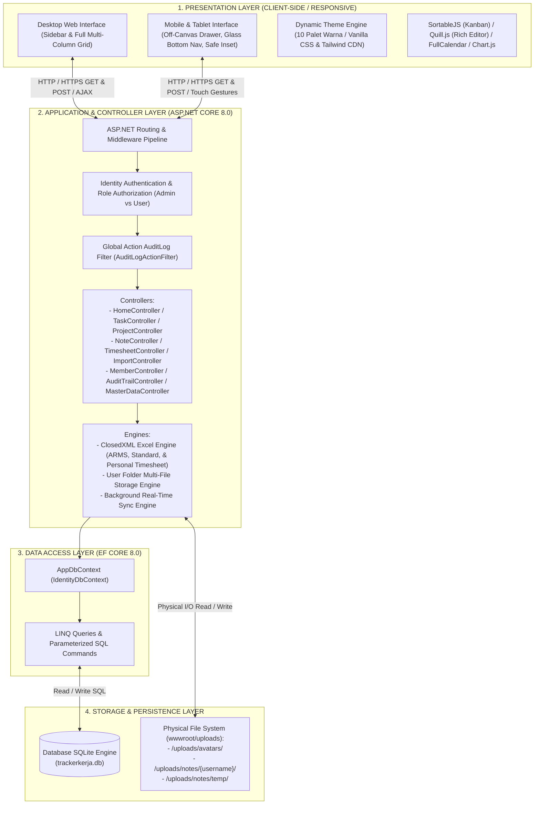
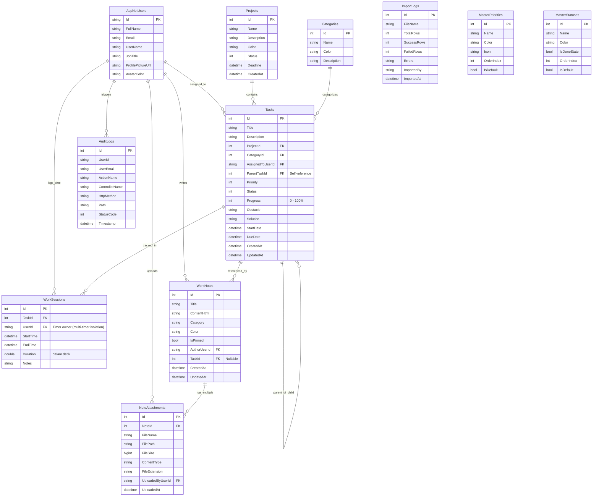
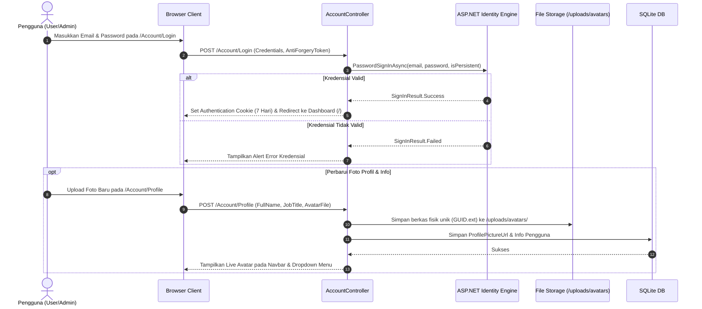
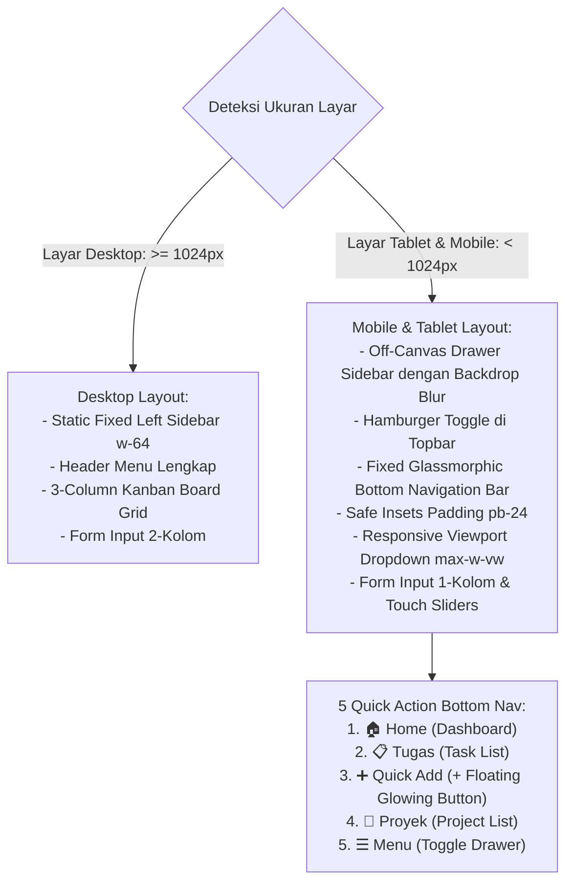
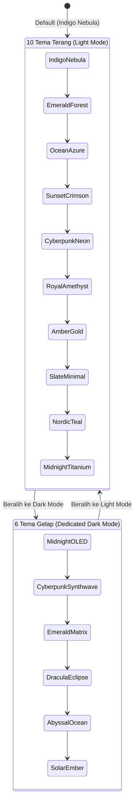
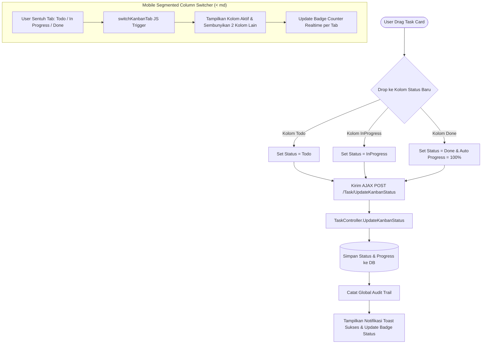
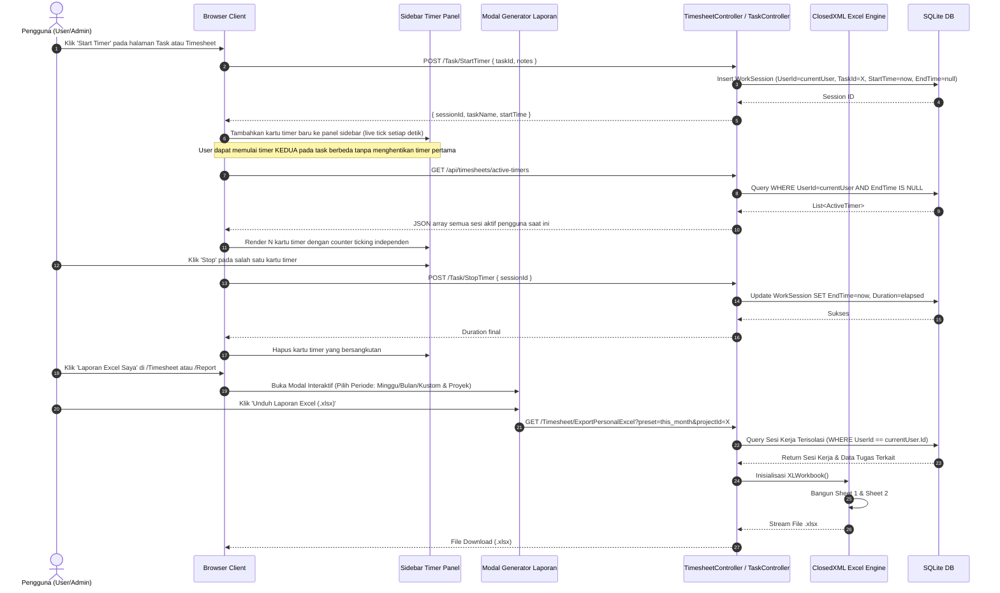
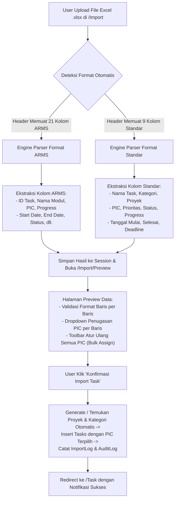

# DOKUMEN SPESIFIKASI FUNGSIONAL (FUNCTIONAL SPECIFICATION DOCUMENT - FSD)
## APLIKASI WORK TRACKER PRO (TRACKERKERJA)

---

### INFORMASI DOKUMEN
- **Nama Aplikasi**: Work Tracker Pro (TrackerKerja)
- **Versi Dokumen**: 3.1 (Advanced Export, Multi-Timer & Admin Controls Edition)
- **Status**: Disetujui & Terimplementasi Penuh
- **Target Platform**: Web Application (ASP.NET Core 8.0 MVC / IIS / Kestrel)
- **Basis Data**: Entity Framework Core 8.0 dengan SQLite Database Engine (`trackerkerja.db`)
- **Engine Spreadsheet**: ClosedXML 0.104.2 (Format ARMS, Template Standar, & Timesheet Personal)
- **Tanggal Rilis**: 27 Agustus 2026

---

## DAFTAR ISI
1. [Pendahuluan & Lingkup Sistem](#1-pendahuluan--lingkup-sistem)
2. [Arsitektur Sistem & Infrastruktur Multi-Device](#2-arsitektur-sistem--infrastruktur-multi-device)
3. [Entity Relationship Diagram (ERD) & Struktur Database](#3-entity-relationship-diagram-erd--struktur-database)
4. [Role-Based Access Control (RBAC) & Matriks Hak Akses](#4-role-based-access-control-rbac--matriks-hak-akses)
5. [Flow Proses & Spesifikasi Modul](#5-flow-proses--spesifikasi-modul)
   - [5.1 Modul Autentikasi & Profil Pengguna](#51-modul-autentikasi--profil-pengguna)
   - [5.2 Modul Sistem Desain Responsif & Mobile / Tablet Navigation](#52-modul-sistem-desain-responsif--mobile--tablet-navigation)
   - [5.3 Modul Sistem Tema Tampilan Dinamis (16 Tema)](#53-modul-sistem-tema-tampilan-dinamis-10-tema)
   - [5.4 Modul Manajemen Proyek & Kategori](#54-modul-manajemen-proyek--kategori)
   - [5.5 Modul Manajemen Tugas & Struktur Parenting](#55-modul-manajemen-tugas--struktur-parenting)
   - [5.6 Modul Kanban Board Interaktif & Mobile Segmented Switcher](#56-modul-kanban-board-interaktif--mobile-segmented-switcher)
   - [5.7 Modul Timesheet, Timer Multi-Tugas Serentak & Laporan Personal Excel (.xlsx)](#57-modul-timesheet--laporan-personal-excel-xlsx)
   - [5.8 Modul Catatan & Multi-File Upload Terorganisir Folder Pengguna](#58-modul-catatan--multi-file-upload-terorganisir-folder-pengguna)
   - [5.9 Modul Import & Export Excel (Filter Periode, Format Standar, Format ARMS, & Timesheet)](#59-modul-import--export-excel-format-standar-format-arms--timesheet)
   - [5.10 Modul Anggota Tim (Member) & Analitik Kontribusi](#510-modul-anggota-tim-member--analitik-kontribusi)
   - [5.11 Modul Audit Trail & Aktivitas Sistem](#511-modul-audit-trail--aktivitas-sistem)
   - [5.12 Modul Master Data (Prioritas & Status)](#512-modul-master-data-prioritas--status)
6. [Spesifikasi Non-Fungsional, Keamanan & Privasi Data](#6-spesifikasi-non-fungsional-keamanan--privasi-data)
7. [Panduan Build, Publishing & Packaging](#7-panduan-build-publishing--packaging)

---

## 1. PENDAHULUAN & LINGKUP SISTEM

### 1.1 Latar Belakang
**Work Tracker Pro (TrackerKerja)** adalah platform manajemen tugas kerja, pelacakan waktu (timesheet), dokumentasi teknis, dan pemantauan kinerja tim terintegrasi yang dirancang untuk mendukung operasional rekayasa perangkat lunak dan manajemen proyek modern secara cepat, akurat, visual, dan sepenuhnya responsif pada seluruh perangkat (desktop, laptop, tablet, hingga smartphone seluler).

### 1.2 Tujuan Sistem
1. Menyediakan visibilitas penuh atas status tugas, beban kerja tim, dan kendala/solusi operasional secara real-time.
2. Memfasilitasi koordinasi hierarkis antar tugas melalui struktur *parent-child task*.
3. Menyederhanakan pencatatan jam kerja harian/mingguan dan menyediakan fitur ekspor laporan timesheet personal ke format Excel (.xlsx) dengan proteksi privasi ketat.
4. Mendukung interoperabilitas enterprise dengan fitur ekspor/impor multi-format (Template Standar dengan penugasan PIC dinamis dan Format Standar ARMS 21 kolom).
5. Menyediakan pengalaman pengguna adaptif multi-device (*responsive & mobile-friendly*) dengan drawer navigasi off-canvas, *glassmorphic bottom bar*, dan mobile column tab switcher.
6. Menyediakan sistem dokumentasi rich-text beserta upload berkas lampiran multi-file yang terorganisir rapi di struktur folder nama pengguna.

---

## 2. ARSITEKTUR SISTEM & INFRASTRUKTUR MULTI-DEVICE

Aplikasi dibangun menggunakan pola arsitektur **Multi-Tier Model-View-Controller (MVC)** dengan pemisahan tanggung jawab yang terstruktur:



---

## 3. ENTITY RELATIONSHIP DIAGRAM (ERD) & STRUKTUR DATABASE

Model data dirancang dengan integritas relasional tinggi, mendukung relasi hierarkis mandiri (*self-referencing parent task*), audit log otomatis, dan lampiran berkas terdistribusi.



---

## 4. ROLE-BASED ACCESS CONTROL (RBAC) & MATRIKS HAK AKSES

Aplikasi menerapkan sistem kontrol akses berbasis peran (*Role-Based Access Control*) dan posisi kerja (*Job Title / Special Privilege*) untuk menjamin integritas data kolaboratif antar tim:

| Fitur / Operasi Sistem | Administrator | System Analyst (SA) | Technical Writer (TW) | Regular User (Dev/QA/dll.) | Keterangan & Proteksi Keamanan |
|:---|:---:|:---:|:---:|:---:|:---|
| **Login / Logout / Profil Pribadi** | ✅ Akses Penuh | ✅ Akses | ✅ Akses | ✅ Akses | Seluruh pengguna dapat mengubah info profil, password, & avatar |
| **Peralihan 16 Tema Tampilan** | ✅ Akses Penuh | ✅ Akses | ✅ Akses | ✅ Akses | Disimpan pada preferensi per sesi / browser |
| **Lihat Dashboard & Kanban Board** | ✅ Akses Penuh | ✅ Akses | ✅ Akses | ✅ Akses | Menampilkan kartu kerja dan metrik tim |
| **Buat Tugas Baru (Create Task)** | ✅ Akses Penuh | ✅ Akses | ✅ Akses | ✅ Akses | Menambahkan tugas baru ke dalam sistem |
| **Ubah Tugas Milik Sendiri (Edit)** | ✅ Akses Penuh | ✅ Akses | ✅ Akses | ✅ Akses | PIC dapat mengubah detail, progress, & kendala tugasnya |
| **Ubah Tugas Pengguna Lain (Edit/Kanban)** | ✅ **Akses Penuh** | ✅ **Diizinkan** | ✅ **Diizinkan** | ❌ **Dibatasi (Tolak)** | Khusus Admin, SA, dan TW untuk keperluan review / analisis / dokumentasi |
| **Mulai Timer / Log Sesi Tugas Orang Lain** | ✅ **Akses Penuh** | ✅ **Diizinkan** | ✅ **Diizinkan** | ❌ **Dibatasi (Tolak)** | Pengguna biasa hanya dapat mencatat jam tugas miliknya |
| **Jalankan Multiple Timer Serentak** | ✅ Akses Penuh | ✅ Akses | ✅ Akses | ✅ Akses | Setiap user dapat menjalankan timer pada 2+ tugas secara bersamaan; sesi terisolasi per `UserId` |
| **Hapus Tugas Milik Sendiri (Single)** | ✅ Akses Penuh | ✅ Akses | ✅ Akses | ✅ Akses | Pemilik tugas dapat menghapus tugas miliknya sendiri |
| **Hapus Tugas Milik Orang Lain (Single)** | ✅ **Akses Khusus** | ❌ **DILARANG** | ❌ **DILARANG** | ❌ **DILARANG** | Hanya Administrator yang dapat menghapus tugas milik personil lain |
| **Hapus Massal (Bulk Delete)** | ✅ Semua Tugas | ⚠️ Hanya Milik Sendiri | ⚠️ Hanya Milik Sendiri | ⚠️ Hanya Milik Sendiri | Non-admin hanya dapat menghapus tugas miliknya sendiri |
| **Kosongkan Seluruh Tugas (Clear All)**| ✅ **Akses Khusus** | ❌ Dibatasi (403) | ❌ Dibatasi (403) | ❌ Dibatasi (403) | `[Authorize(Roles = "Admin")]` & tombol disembunyikan |
| **Ekspor Tugas (Standard & ARMS, Filter Periode)** | ✅ Akses Penuh | ✅ Akses | ✅ Akses | ✅ Akses | Mendukung `selectedIds`, `period`, `startDate`, `endDate`, `projectId`, `status`, `priority` |
| **Buat / Edit Proyek Baru** | ✅ **Akses Khusus** | ❌ Dibatasi (403) | ❌ Dibatasi (403) | ❌ Dibatasi (403) | `[Authorize(Roles = "Admin")]` pada `ProjectController` |
| **Lihat & Catat Timesheet Harian** | ✅ Akses Penuh | ✅ Akses | ✅ Akses | ✅ Akses | User hanya melihat tugas yang terkait dirinya |
| **Generate Laporan Timesheet Personal**| ✅ Akses Penuh | ✅ Akses | ✅ Akses | ✅ Akses | Menghasilkan .xlsx multi-sheet terisolasi data personal |
| **Reset / Hapus SEMUA Timesheet** | ✅ **Akses Khusus** | ❌ Dibatasi (403) | ❌ Dibatasi (403) | ❌ Dibatasi (403) | `[Authorize(Roles = "Admin")]` pada `TimesheetController` |
| **Catatan & Multi-File Upload** | ✅ Akses Penuh | ✅ Akses | ✅ Akses | ✅ Akses | Disimpan di `wwwroot/uploads/notes/{username}/` |
| **Export Format ARMS & Standar** | ✅ Akses Penuh | ✅ Akses | ✅ Akses | ✅ Akses | Generator ClosedXML 21 kolom & standar |
| **Import Task Excel & Reassign PIC** | ✅ **Akses Khusus** | ❌ Dibatasi | ❌ Dibatasi | ❌ Dibatasi | Khusus pengelolaan data terpusat oleh Admin |
| **Reset Password Anggota Tim (Admin)** | ✅ **Akses Khusus** | ❌ DILARANG | ❌ DILARANG | ❌ DILARANG | `POST /Member/ResetPassword/{id}` & `POST /api/members/{id}/reset-password` — Admin only |
| **Pengaturan Master Data & Audit Trail**| ✅ **Akses Khusus** | ❌ Dibatasi (403) | ❌ Dibatasi (403) | ❌ Dibatasi (403) | Menu & controller dilindungi khusus Admin |

---

## 5. FLOW PROSES & SPESIFIKASI MODUL

### 5.1 Modul Autentikasi & Profil Pengguna

Modul ini menangani pendaftaran, sesi masuk, ganti kata sandi, pengaturan profil, dan upload foto avatar pengguna.



#### Kebijakan Tampilan Halaman Login:
- Formulir login dirancang bersih (*clean design*) tanpa menampilkan informasi kredensial demo untuk menjamin kesiapan lingkungan produksi.
- Input kata sandi dilengkapi dengan fitur *toggle view/hide password* (`eye-icon`).

---

### 5.2 Modul Sistem Desain Responsif & Mobile / Tablet Navigation

Aplikasi mengimplementasikan sistem layout adaptif untuk menjamin kenyamanan penggunaan pada berbagai ukuran layar:



#### Fitur Utama Responsif:
1. **Off-Canvas Sidebar Drawer**: Sidebar desktop disembunyikan ke luar layar (`-translate-x-full lg:translate-x-0`) dan muncul mulus saat tombol hamburger atau tombol menu bawah disentuh.
2. **Glassmorphic Bottom Navigation Bar**: Bilah navigasi melayang di bagian bawah dengan efek *backdrop blur* dan ikon sentuh yang lapang.
3. **Safe Insets & Content Padding**: Kontainer utama memiliki `pb-24 lg:pb-6` dan utilitas `.pb-safe` untuk mendukung gestur navigasi dan *notch* pada perangkat iOS dan Android.
4. **Batas Lebar Dropdown**: Dropdown notifikasi, tema warna, dan profil pengguna dibatasi dengan `max-w-[calc(100vw-1.5rem)]` agar tidak terpotong pada smartphone beresolusi 320px–414px.

---

### 5.3 Modul Sistem Tema Tampilan Dinamis (16 Tema: 10 Light & 6 Dark)

Sistem tema menyediakan **16 preset tema modern** yang mencakup palet tema terang (*Light Mode*) dan tema gelap (*Dark Mode*) yang dapat diganti secara instan dari switcher topbar maupun menu profil tanpa me-reload halaman secara penuh.



#### A. 6 Preset Tema Gelap (Dark Mode):
1. **Midnight OLED**: `#6366F1` & `#38BDF8` pada latar hitam pekat `#07090E` (Aksen Neon Indigo & Cyan).
2. **Cyberpunk Synthwave**: `#F43F5E` & `#06B6D4` pada latar obsidian `#0A0714` (Fuchsia Neon & Electric Cyan).
3. **Emerald Matrix**: `#10B981` & `#34D399` pada latar emerald gelap `#03100C` (Hacker Matrix Green).
4. **Dracula Eclipse**: `#A855F7` & `#EC4899` pada latar ungu malam `#0D0818` (Dracula Purple & Pastel Pink).
5. **Abyssal Ocean**: `#38BDF8` & `#3B82F6` pada latar samudra dalam `#040A14` (Sapphire Blue Deep Space).
6. **Solar Ember**: `#F97316` & `#F59E0B` pada latar arang lava `#0E0804` (Flame Orange & Warm Gold).

#### B. 10 Preset Tema Terang (Light Mode):
1. **Indigo Nebula (Default)**: `#6366F1` & `#8B5CF6` (Modern Tech Aesthetic)
2. **Emerald Forest**: `#10B981` & `#0D9488` (Harmonis, Sejuk)
3. **Ocean Azure**: `#0284C7` & `#2563EB` (Segar, Profesional)
4. **Sunset Crimson**: `#F43F5E` & `#EA580C` (Hangat, Enerjik)
5. **Cyberpunk Neon**: `#D946EF` & `#06B6D4` (High Contrast Neon)
6. **Royal Amethyst**: `#9333EA` & `#6366F1` (Mewah, Premium)
7. **Amber Gold**: `#F59E0B` & `#EA580C` (Klasik Emas)
8. **Slate Minimalist**: `#475569` & `#334155` (Clean Monochrome)
9. **Nordic Teal**: `#0D9488` & `#0284C7` (Toska Segar)
10. **Midnight Titanium**: `#6366F1` & `#38BDF8` (Titanium Cerah)

---

### 5.4 Modul Manajemen Proyek & Kategori

- **Manajemen Proyek**: Memuat Nama, Deskripsi, Warna Brand, Deadline, dan Status (`Active`, `OnHold`, `Completed`). Progress proyek dihitung secara dinamis dari agregasi progress tugas di dalamnya.
- **Manajemen Kategori**: Pengelompokan jenis pekerjaan seperti *Backend*, *Frontend*, *API / REST*, *Database*, *DevOps*, dan *Testing*.
- **Proteksi Akses**: Penambahan, pengeditan, dan penghapusan proyek dilindungi secara ketat untuk peran **Admin**.

---

### 5.5 Modul Manajemen Tugas & Struktur Parenting

Tugas (*WorkTask*) adalah unit kerja utama dengan atribut lengkap:
- **Identifikasi Unik**: ID numeric dan Kode Task otomatis (`TSK-XXXX`).
- **Hierarki Parenting (`ParentTaskId`)**:
  - Sebuah tugas dapat menjadi induk (*Parent Task*) atau sub-tugas (*Child Task*).
  - Jika tugas tidak memiliki parent, maka kode parent task adalah kode tugas itu sendiri.
- **Kolom Kendala & Solusi**: Textarea `Obstacle` untuk mencatat hambatan operasional dan `Solution` untuk dokumentasi pemecahan masalah.
- **Manajemen Progress Dinamis**:
  - Nilai progress dari `0%` sampai `100%`.
  - Slider interaktif dan tombol preset cepat (`0%`, `25%`, `50%`, `75%`, `100%`).
  - **Sinkronisasi Otomatis**: Jika status diubah menjadi `Done`, progress otomatis dikunci ke `100%`. Sebaliknya jika progress diset `100%`, status otomatis sinkron ke `Done`.

#### Kontrol Akses Tugas Berbasis Peran & Jabatan (`TaskPermissionHelper`):
1. **Hak Akses Pengubahan (Edit, Ubah Status, Kanban, Timer, & Sesi Kerja)**:
   - **Administrator**: Memiliki hak penuh untuk mengubah detail, progress, kendala, solusi, status kanban, dan timer pada seluruh tugas.
   - **System Analyst (SA) & Technical Writer (TW)**: Diizinkan mengubah tugas milik personil/pengguna lain guna mendukung proses analisis kebutuhan, revisi spesifikasi teknis, dan dokumentasi.
   - **Regular Users (Developer, QA, DevOps, dll.)**: Hanya dapat mengubah (*Edit*) tugas miliknya sendiri (`AssignedToUserId == currentUser.Id`). Upaya mengubah tugas orang lain akan diblokir oleh backend dengan pesan *"Akses Ditolak"*.
2. **Hak Akses Penghapusan (Single Delete & Bulk Delete)**:
   - **Administrator**: Satu-satunya peran yang berhak menghapus tugas milik pengguna mana pun di sistem, termasuk operasi *Clear All Tasks*.
   - **System Analyst (SA) & Technical Writer (TW)**: **DILARANG KERAS** menghapus tugas milik pengguna lain. SA dan TW hanya dapat menghapus tugas yang ditugaskan kepada diri mereka sendiri.
   - **Regular Users**: Hanya dapat menghapus tugas miliknya sendiri. Operasi penghapusan massal (*Bulk Delete*) secara otomatis menyaring dan melewati tugas milik orang lain jika tidak memiliki otorisasi.

---

### 5.6 Modul Kanban Board Interaktif & Mobile Segmented Switcher

Kanban Board menyediakan antarmuka visual berbasis drag-and-drop untuk memindahkan status tugas secara real-time.



#### Fitur Khusus Mobile pada Kanban:
Pada smartphone (`< md`), pengguna tidak perlu melakukan *scroll* vertikal ribuan piksel melintasi 3 kolom panjang. Disediakan bilah **Segmented Pill Switcher Tabs** (`📋 Todo`, `🔄 In Progress`, `✅ Done`) yang memungkinkan perpindahan kolom secara instan hanya dengan sekali sentuh.

---

### 5.7 Modul Timesheet, Timer Multi-Tugas Serentak & Laporan Personal Excel (.xlsx)

Modul Timesheet (`/Timesheet`) mengelola alur pencatatan jam kerja harian, mingguan, serta penyusunan laporan spreadsheet formal:



#### Isolasi Timer Multi-Pengguna:
- Kolom `UserId` pada tabel `WorkSessions` memastikan sesi timer terisolasi per pengguna.
- User A dapat menjalankan timer pada Task-1 dan Task-2 secara bersamaan; User B yang juga login dapat menjalankan timer pada Task-1 atau Task lain **tanpa interferensi**.
- Endpoint `GET /api/timesheets/active-timers` mengembalikan hanya sesi aktif milik `currentUser.Id`.
- Sidebar `_Layout.cshtml` menampilkan panel **Active Timers** dengan N kartu, masing-masing berticker independen via `setInterval`.

#### Struktur & Spesifikasi Laporan Excel (.xlsx):
1. **Sheet 1 ("Timesheet Personal")**:
   - **Header Banner**: Deep Indigo (`#312E81`), teks putih tebal 16pt, subjudul sistem.
   - **Info Box Metadata**: Nama Karyawan, Email, Jabatan, Periode Laporan, Filter Proyek, Tanggal & Jam Generate, Total Sesi, dan Total Jam Kerja.
   - **Tabel Data Terperinci**: *No, Tanggal, Hari, Kode Tugas, Judul Tugas, Nama Proyek, Kategori, Status Tugas, Progress (%), Jam Mulai, Jam Selesai, Durasi (Jam), Durasi (Format JJ:MM:DD), Catatan Pekerjaan*.
   - **Baris Grand Total**: Formula otomatis Excel `=SUM(L9:L{n})`.
2. **Sheet 2 ("Rekap per Proyek")**:
   - Tabel distribusi waktu kerja: *No, Nama Proyek, Total Sesi, Total Durasi (Jam), Persentase Alokasi Waktu (%)*.
3. **Prinsip Keamanan & Privasi Data**:
   - Query laporan: `Where(s => s.UserId == currentUser.Id)`. Pengguna tidak dapat mengakses data jam kerja orang lain. Query laporan menerapkan isolasi ketat: `Where(s => s.Task.AssignedToUserId == currentUser.Id)`. Pengguna tidak dapat mengakses atau mengekstrak data pencatatan jam kerja orang lain.

---

### 5.8 Modul Catatan & Multi-File Upload Terorganisir Folder Pengguna

Modul Dokumentasi Kerja & Notula menyediakan editor Rich Text (Quill.js) serta sistem lampiran berkas multi-file yang terisolasi rapi berdasarkan folder nama pengguna.

```mermaid
flowchart LR
    subgraph UploadFlow["Alur Upload Multi-File Catatan"]
        UserAction["User Pilih / Drag Multiple File di /Note/Create atau /Note/Edit"] --> Input[Input type=file multiple]
        Input --> JSPreview["Live JS Preview:\n- Ikon Format File\n- Nama & Ukuran KB/MB\n- Tombol Hapus per Item"]
        JSPreview --> Submit["Submit Form (enctype=multipart/form-data)"]
        Submit --> Controller["NoteController.SaveAttachmentsAsync"]
    end

    subgraph FolderSanitization["Struktur Folder Pengguna"]
        Controller --> Sanitize["Sanitasi Nama Pengguna:\nGlenn Hakim -> 'glenn_hakim'\nHeni Rahayu -> 'heni_rahayu'"]
        Sanitize --> TargetDir["Direktori Fisik:\nwwwroot/uploads/notes/{username}/"]
        TargetDir --> GenerateName["Format Nama File Unik:\n{yyyyMMdd_HHmmss}_{GUID8}_{CleanFileName}.ext"]
        GenerateName --> SaveDisk["Tulis Berkas Fisik ke Harddisk"]
        SaveDisk --> SaveDB["Insert Record ke Tabel NoteAttachments"]
    end

    subgraph AccessFlow["Alur Akses & Manajemen Lampiran"]
        SaveDB --> ViewDetails["/Note/Details/{id} Menampilkan Panel Lampiran:\n- Thumbnail Gambar\n- File Meta & Uploader\n- Tombol Download & Preview"]
        ViewDetails --> Download["GET /Note/DownloadAttachment/{id}\n(Streaming File dengan Nama Asli & MIME Type)"]
        ViewDetails --> DeleteAtt["POST /Note/DeleteAttachment/{id}\n(Hapus File Fisik di Disk & Record DB)"]
    end
```



---

### 5.9 Modul Import & Export Excel (Filter Periode, Format Standar, Format ARMS, & Timesheet)

Sistem mendukung 3 jenis format pertukaran data spreadsheet (.xlsx) menggunakan ClosedXML Engine:
1. **Laporan Timesheet Personal**: Multi-sheet (.xlsx) terisolasi untuk masing-masing pengguna.
2. **Format Ekspor ARMS Enterprise (21 Kolom)**: Digunakan untuk interoperabilitas sistem enterprise.
3. **Format Impor & Ekspor Standar (9 Kolom)**: Dilengkapi dengan wizard pratinjau interaktif dan penugasan PIC fleksibel.

#### Parameter Filter Ekspor Tugas (v3.1)
Endpoint `GET /Task/ExportArmsExcel` dan `GET /Task/ExportStandardExcel` mendukung parameter berikut:

| Parameter | Tipe | Deskripsi |
|:---|:---|:---|
| `selectedIds` | string | Koma-separated ID tugas yang dipilih (prioritas utama jika diisi) |
| `period` | string | Preset waktu: `today`, `yesterday`, `last7days`, `last30days`, `this_month`, `last_month` |
| `startDate` | string | Tanggal mulai kustom (format YYYY-MM-DD), digunakan jika `period` kosong |
| `endDate` | string | Tanggal akhir kustom (format YYYY-MM-DD), digunakan jika `period` kosong |
| `projectId` | int | Filter berdasarkan proyek |
| `status` | string | Filter berdasarkan status tugas |
| `priority` | string | Filter berdasarkan prioritas |
| `assigneeId` | string | Filter berdasarkan ID assignee |
| `milestone` | string | Filter berdasarkan milestone SDLC |
| `search` | string | Filter berdasarkan kata kunci judul/deskripsi |

Helper function `ApplyTaskExportFilters()` pada `TaskController.cs` menerapkan seluruh filter ini secara berantai pada IQueryable sebelum materialisasi.



---

### 5.10 Modul Anggota Tim (Member), Analitik Kontribusi & Reset Password

Modul Anggota Tim (`/Member`) menyajikan profil performa dan metrik keterlibatan setiap personil:
- **Personal Member Dashboard**: Menampilkan ringkasan tugas aktif, tugas selesai, jam kerja yang tercatat, dan catatan mandiri per individu.
- **Stacked Bar Chart Beban Kerja Tim**: Memvisualisasikan distribusi tugas per anggota tim berdasarkan status (*Todo*, *InProgress*, *Done*).
- **Matriks Kontribusi Tim per Proyek**: Diagram distribusi interaktif dengan dropdown filter untuk menganalisis porsi kontribusi personil pada proyek tertentu.

#### Reset Password Anggota Tim oleh Administrator (v3.1)

Fitur ini memungkinkan Administrator mereset password anggota tim **secara langsung** tanpa alur "Forgot Password" tradisional:

- **MVC Endpoint**: `POST /Member/ResetPassword/{id}` dengan parameter `newPassword` dan `returnUrl`.
- **API Endpoint**: `POST /api/members/{id}/reset-password` dengan request body `{ "newPassword": "..." }`.
- **Mekanisme**: Menggunakan `UserManager.GeneratePasswordResetTokenAsync()` + `UserManager.ResetPasswordAsync()` dari ASP.NET Identity untuk proses yang aman.
- **Proteksi Akses**: Dilindungi oleh `[Authorize(Roles = "Admin")]`. Seluruh aksi dicatat di Audit Trail secara otomatis.
- **UI**: Tersedia sebagai tombol ikon kunci (key icon) di kartu member (`/Member`) dan form reset di halaman detail (`/Member/Details/{id}`) dengan toggle show/hide password.

---

### 5.11 Modul Audit Trail & Aktivitas Sistem

Seluruh aktivitas mutasi data dan autentikasi dicatat otomatis melalui **Global Action Filter (`AuditLogActionFilter`)**:
- **Pencatatan Komprehensif**: Menyimpan `UserId`, `UserEmail`, `ControllerName`, `ActionName`, `HttpMethod`, `Path`, `StatusCode`, `DurationMs`, dan `Timestamp`.
- **Visualisasi Multi-Series Line Chart**: Grafik tren aktivitas harian yang dikelompokkan berdasarkan kategori aksi (*GET / View*, *Create / Tambah*, *Edit / Ubah*, *Delete / Hapus*, *Login*, *Logout*).
- **Filter & Export CSV**: Pencarian berdasarkan rentang tanggal, jenis aksi, atau email pengguna, serta fitur unduh laporan audit trail dalam format CSV.

---

### 5.12 Modul Master Data (Prioritas & Status)

Menyediakan antarmuka bagi Admin untuk mengelola data referensi:
- **Master Prioritas**: Nama, warna representasi (*hex color*), ikon FontAwesome, dan urutan tampilan (*Order Index*).
- **Master Status**: Nama status, warna, penanda status selesai (*IsDoneState*), dan status default.

---

## 6. SPESIFIKASI NON-FUNGSIONAL, KEAMANAN & PRIVASI DATA

### 6.1 Keamanan & Privasi Data (Security & Data Privacy)
1. **Anti-CSRF Protection**: Seluruh form mutasi state (POST/PUT/DELETE) dilindungi oleh `@Html.AntiForgeryToken()` dan atribut `[ValidateAntiForgeryToken]`.
2. **Proteksi Akses Role-Based**: Penggunaan atribut `[Authorize]` dan `[Authorize(Roles = "Admin")]` pada level controller dan action method.
3. **Isolasi Data Personal**: Endpoint laporan timesheet personal memfilter record secara ketat menggunakan klausa LINQ berbasis ID pengguna yang terotentikasi.
4. **Pencegahan SQL Injection**: Seluruh query data dieksekusi melalui Entity Framework Core parameterized LINQ queries.
5. **Sanitasi File Storage & Path Traversal Prevention**:
   - Nama folder pengguna dan nama file di-sanitasi secara ketat menggunakan regex `[^a-zA-Z0-9_\-\.]+`.
   - Nama file fisik selalu diberi prefix unik timestamp dan GUID untuk mencegah penimpaan file atau eksploitasi path traversal (`../`).
   - Batasan ukuran upload file maksimum 10MB per berkas.

### 6.2 Performa & Keandalan (Performance & Reliability)
1. **Indeksasi Database**: Indeks pada kolom pencarian utama (`Tasks.ProjectId`, `Tasks.AssignedToUserId`, `Tasks.ParentTaskId`, `AuditLogs.Timestamp`).
2. **Efisiensi Streaming File**: Endpoint download berkas menggunakan `PhysicalFileResult` stream native ASP.NET Core tanpa membebani konsumsi RAM server.
3. **Client-Side Optimization**: CDN terpercaya untuk library font dan icon, dynamic CSS variables untuk render tema instan tanpa flicker.

---

## 7. PANDUAN BUILD, PUBLISHING & PACKAGING

### 7.1 Kompilasi & Build Release
Proyek dapat dikompilasi menggunakan .NET SDK 8.0:
```cmd
dotnet build -c Release
```

### 7.2 Publikasi Mandiri & Pengarsipan Zip
Perintah untuk mempublikasikan aplikasi dan menghasilkan arsip file siap-deploy:
```cmd
dotnet publish -c Release -o ./publish
```
Setelah publish selesai, file database `trackerkerja.db` disertakan di dalam folder `publish/`, kemudian direktori tersebut dikompresi ke dalam `TrackerKerja_Publish.zip`.

### 7.3 Cara Menjalankan Aplikasi di Server
```cmd
TrackerKerja.exe --urls=http://localhost:5000
```
*atau menggunakan .NET Runtime CLI:*
```bash
dotnet TrackerKerja.dll --urls=http://localhost:5000
```

---

### 📦 Lokasi Publikasi IIS & Source Code
Dokumentasi FSD ini merefleksikan arsitektur dan fungsionalitas yang telah aktif dan teruji pada:
👉 **Arsip Rilis Zip**: `c:\TEMP\VSCODE\TrackerKerja\TrackerKerja_Publish.zip`  
👉 **Folder Publish**: `c:\TEMP\VSCODE\TrackerKerja\publish\`  
👉 **Source Code**: `c:\TEMP\VSCODE\TrackerKerja\`
