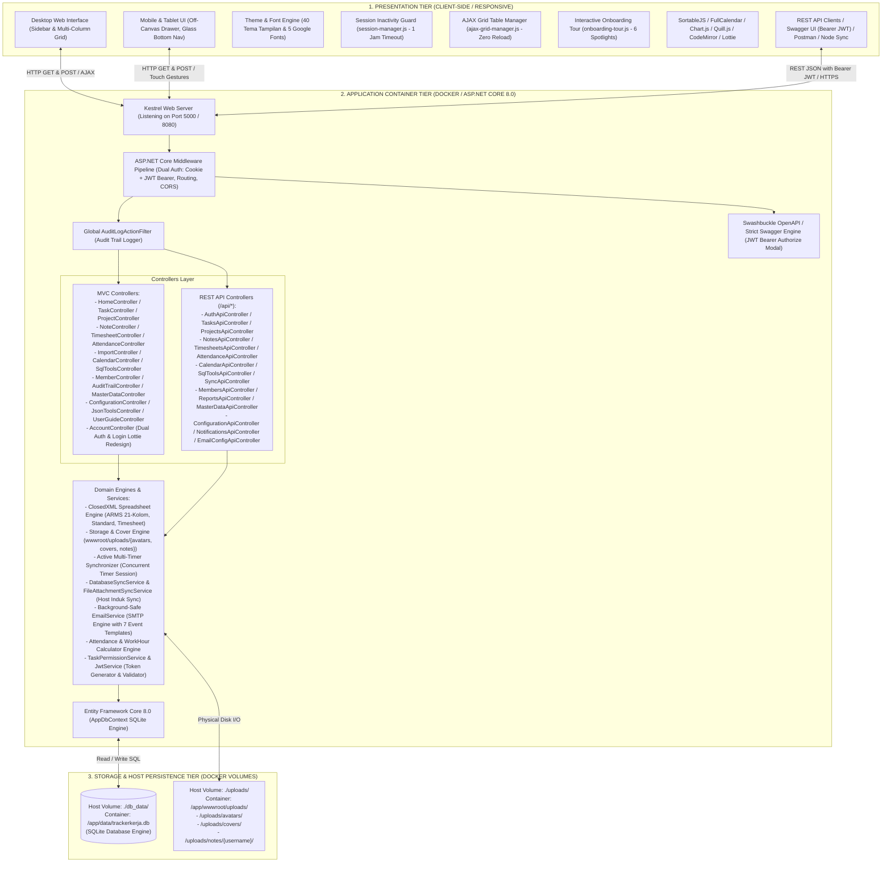
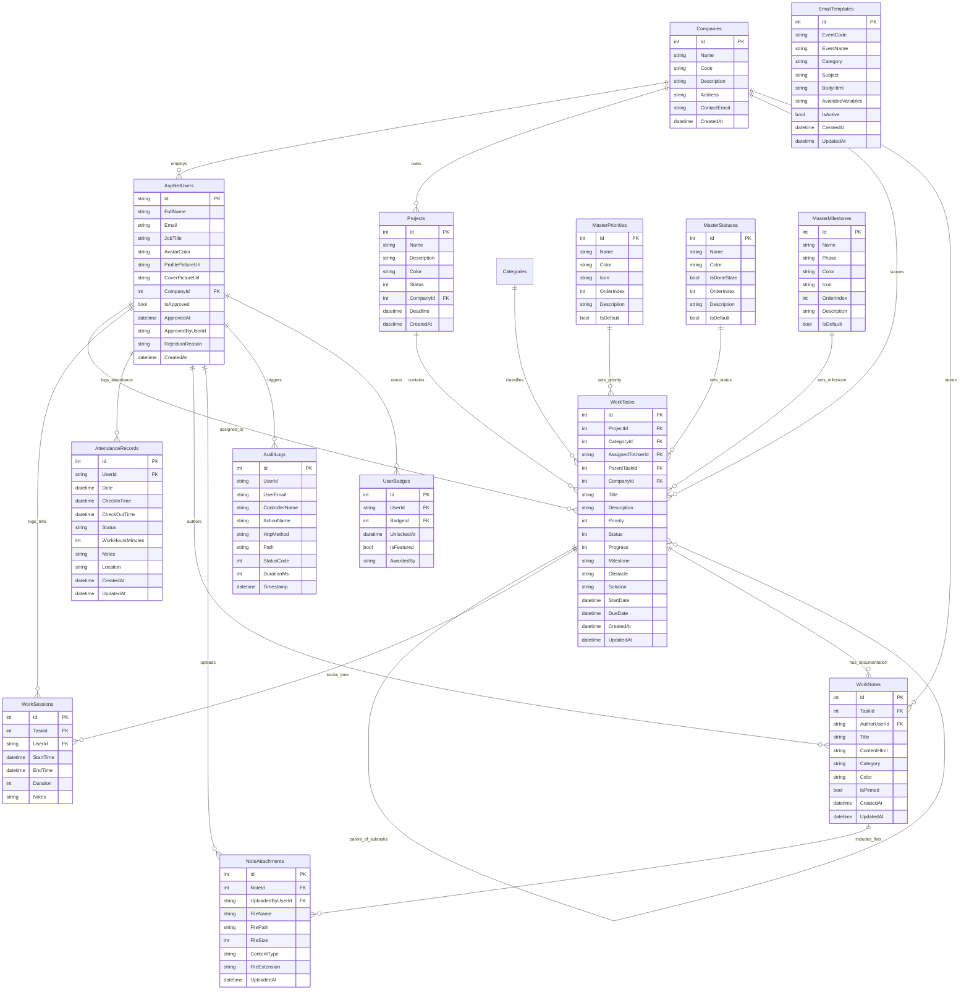

# DOKUMEN SPESIFIKASI FUNGSIONAL (FUNCTIONAL SPECIFICATION DOCUMENT - FSD)
## APLIKASI WORK TRACKER PRO (TRACKERKERJA)

---

### INFORMASI DOKUMEN
- **Nama Aplikasi**: Work Tracker Pro (TrackerKerja)
- **Versi Dokumen**: 3.6 (Enterprise Security, Dual Auth, Multi-Instance & UI Ergonomics Edition)
- **Status**: Disetujui & Terimplementasi Penuh (Production-Ready)
- **Target Platform**: Web Application (ASP.NET Core 8.0 MVC / REST API / Docker Linux Container)
- **Basis Data**: Entity Framework Core 8.0 dengan SQLite Database Engine (`/app/data/trackerkerja.db` via `./db_data` volume)
- **Engine Spreadsheet**: ClosedXML 0.104.2 (Format ARMS 21-kolom, Template Standar 9-kolom, & Timesheet Personal)
- **Dokumentasi REST API**: OpenAPI 3.0 via Swashbuckle Swagger UI (`/swagger`) dengan Strict JWT Bearer Authorization & Postman Collection
- **Repositori Source Code**: [https://github.com/zhavick/TrackerKerja.git](https://github.com/zhavick/TrackerKerja.git)
- **Tanggal Rilis & Pembaruan**: 24 September 2026

---

## DAFTAR ISI
1. [Pendahuluan & Lingkup Sistem](#1-pendahuluan--lingkup-sistem)
2. [Arsitektur Sistem & Infrastruktur Container](#2-arsitektur-sistem--infrastruktur-container)
3. [Entity Relationship Diagram (ERD) & Struktur Database](#3-entity-relationship-diagram-erd--struktur-database)
4. [Role-Based Access Control (RBAC) & Matriks Hak Akses](#4-role-based-access-control-rbac--matriks-hak-akses)
5. [Flow Proses & Spesifikasi Modul](#5-flow-proses--spesifikasi-modul)
   - [5.1 Modul Autentikasi Ganda (Dual Auth), Keamanan Sesi, Admin Approval & Multi-Tenancy](#51-modul-autentikasi-ganda-dual-auth-keamanan-sesi-admin-approval--multi-tenancy)
     - [5.1.1 Arsitektur Autentikasi Ganda: Cookie Web & JWT Bearer Token](#511-arsitektur-autentikasi-ganda-cookie-web--jwt-bearer-token)
     - [5.1.2 Keamanan Sesi & Auto-Logout Inaktivitas 1 Jam](#512-keamanan-sesi--auto-logout-inaktivitas-1-jam)
     - [5.1.3 Alur Persetujuan Registrasi Pengguna Baru (Admin Approval Workflow)](#513-alur-persetujuan-registrasi-pengguna-baru-admin-approval-workflow)
     - [5.1.4 Modul Multi-Tenancy Organisasi & Perusahaan (Company Isolation)](#514-modul-multi-tenancy-organisasi--perusahaan-company-isolation)
   - [5.2 Modul Sistem Desain Responsif & Mobile Navigation](#52-modul-sistem-desain-responsif--mobile-navigation)
   - [5.3 Modul Sistem Tema Tampilan Dinamis (40 Tema) & Global Font Switcher (5 Google Fonts)](#53-modul-sistem-tema-tampilan-dinamis-40-tema--global-font-switcher-5-google-fonts)
   - [5.4 Modul Manajemen Proyek & Kategori](#54-modul-manajemen-proyek--kategori)
   - [5.5 Modul Manajemen Tugas, Struktur Parenting & Penyatuan Timesheet Manual](#55-modul-manajemen-tugas-struktur-parenting--penyatuan-timesheet-manual)
   - [5.6 Modul Kanban Board Interaktif & Mobile Segmented Switcher](#56-modul-kanban-board-interaktif--mobile-segmented-switcher)
   - [5.7 Modul Timesheet, Multi-Timer Serentak & Laporan Personal Excel (.xlsx)](#57-modul-timesheet-multi-timer-serentak--laporan-personal-excel-xlsx)
   - [5.8 Modul Presensi & Rekonsiliasi Absensi Tim (Attendance Management)](#58-modul-presensi--rekonsiliasi-absensi-tim-attendance-management)
   - [5.9 Modul Catatan & Multi-File Upload Terorganisir Folder Pengguna](#59-modul-catatan--multi-file-upload-terorganisir-folder-pengguna)
   - [5.10 Modul Import & Export Excel (Filter Periode, Format Standar, Format ARMS)](#510-modul-import--export-excel-filter-periode-format-standar-format-arms)
   - [5.11 Modul Anggota Tim (Member), Direktori Pure Grid Card, Banner Profil & Hapus Permanen Akun](#511-modul-anggota-tim-member-direktori-pure-grid-card-banner-profil--hapus-permanen-akun)
   - [5.12 Modul Audit Trail & Aktivitas Sistem](#512-modul-audit-trail--aktivitas-sistem)
   - [5.13 Modul Master Data (Prioritas, Status & Milestone SDLC)](#513-modul-master-data-prioritas-status--milestone-sdlc)
   - [5.14 Modul Kalender Tugas Interaktif & Role-Based Scope Filter](#514-modul-kalender-tugas-interaktif--role-based-scope-filter)
   - [5.15 Modul SQL Beautifier & Query Tools](#515-modul-sql-beautifier--query-tools)
   - [5.16 Modul Multi-Instance Synchronization & File Attachment Sync (Host Induk Sync)](#516-modul-multi-instance-synchronization--file-attachment-sync-host-induk-sync)
   - [5.17 Modul RESTful API (100+ Endpoints) & Strict Swagger JWT Bearer Authorization](#517-modul-restful-api-100-endpoints--strict-swagger-jwt-bearer-authorization)
   - [5.18 Modul Integrasi Server Email (SMTP) & Sub-Modul Template Email Event](#518-modul-integrasi-server-email-smtp--sub-modul-template-email-event)
   - [5.19 Pembaruan Navigasi, Ergonomi Antarmuka, Halaman Login Lottie, Onboarding Tour & AJAX Grid Table Pagination](#519-pembaruan-navigasi-ergonomi-antarmuka-halaman-login-lottie-onboarding-tour--ajax-grid-table-pagination)
6. [Spesifikasi Non-Fungsional, Keamanan & Privasi Data](#6-spesifikasi-non-fungsional-keamanan--privasi-data)
7. [Panduan Docker Containerization, Git Repository & Deployment](#7-panduan-docker-containerization-git-repository--deployment)

---

## 1. PENDAHULUAN & LINGKUP SISTEM

### 1.1 Latar Belakang
**Work Tracker Pro (TrackerKerja)** adalah platform manajemen tugas kerja, pelacakan waktu (timesheet), presensi kerja (attendance), dokumentasi teknis, utilitas database/SQL, dan analitik kinerja tim terintegrasi yang dirancang untuk mendukung operasional rekayasa perangkat lunak modern. Aplikasi dapat dijalankan secara mandiri (.NET runtime) maupun dikemas dalam container Docker Linux yang ringan, portable, dan siap produksi di lingkungan on-premise maupun cloud multi-instance.

### 1.2 Tujuan Sistem
1. **Visibilitas Operasional Penuh**: Status tugas real-time, beban kerja tim, log kendala operasional (*Obstacle*), dan solusi teknis (*Solution*).
2. **Hierarki Tugas**: Relasi terstruktur antara tugas induk (*Parent Task*) dan sub-tugas (*Child Task*).
3. **Pencatatan Jam Kerja & Multi-Timer**: Pelacakan jam kerja fleksibel dengan kemampuan menjalankan multi-timer serentak per user serta ekspor laporan timesheet personal Excel multi-sheet terproteksi.
4. **Presensi Terintegrasi & Rekonsiliasi**: Pencatatan kehadiran harian (Check-in/Check-out, WFH, Izin, Sakit, Cuti) dengan rekapitulasi tim bagi manajemen.
5. **Kalender Tugas dengan Kontrol Hak Akses**: Visualisasi deadline tugas dengan pembatasan hak akses berbasis peran (User hanya melihat tugas sendiri, Admin dapat memilih tugas sendiri atau seluruh tim).
6. **Utilitas Developer Terintegrasi**: SQL Beautifier, Validator, dan Minifier mendukung 15+ dialek database tanpa memerlukan tool pihak ketiga eksternal.
7. **Sinkronisasi Multi-Instance**: Dukungan sinkronisasi data antar node lokal ke server Host Induk terpusat secara online via REST API maupun offline via SQL Dump.
8. **Interoperabilitas Enterprise**: Pertukaran data spreadsheet format ARMS (21 kolom) dan format standar (9 kolom) dengan filter periode waktu dinamis.
9. **Responsivitas Multi-Device**: Antarmuka adaptif dengan off-canvas drawer, glassmorphic bottom bar, dan segmented kanban column switcher pada perangkat seluler.
10. **Ekosistem API Modern**: RESTful API lengkap (80+ endpoint) terdokumentasi OpenAPI Swagger v3.0 dan Postman Collection.

---

## 2. ARSITEKTUR SISTEM & INFRASTRUKTUR CONTAINER

Aplikasi dibangun menggunakan pola arsitektur **Multi-Tier Model-View-Controller (MVC) & RESTful Web API** yang di-enkapsulasi di dalam **Docker Container** dengan proteksi keamanan terstandarisasi enterprise:



---

## 3. ENTITY RELATIONSHIP DIAGRAM (ERD) & STRUKTUR DATABASE



---

## 4. ROLE-BASED ACCESS CONTROL (RBAC) & MATRIKS HAK AKSES

| Modul / Operasi | Administrator | System Analyst | Technical Writer | User Biasa |
| :--- | :---: | :---: | :---: | :---: |
| **Login, Profil & Dashboard** | ✅ Akses Penuh | ✅ Akses | ✅ Akses | ✅ Akses |
| **Buat & Ubah Tugas Sendiri** | ✅ Akses Penuh | ✅ Akses | ✅ Akses | ✅ Akses |
| **Ubah Tugas Anggota Lain** | ✅ Akses Penuh | ✅ Akses *(Elevated)* | ✅ Akses *(Elevated)* | ❌ Dilarang |
| **Penyatuan Edit Tugas & Jam Kerja**| ✅ Akses Penuh | ✅ Akses *(Elevated)* | ✅ Akses *(Elevated)* | ✅ Akses *(Tugas Sendiri)* |
| **Mulai Timer pada Tugas Lain**| ✅ Akses Penuh | ✅ Akses *(Elevated)* | ✅ Akses *(Elevated)* | ❌ Dilarang |
| **Multi-Timer Serentak Sendiri**| ✅ Akses Penuh | ✅ Akses | ✅ Akses | ✅ Akses |
| **Presensi Mandiri (Check-in/out)**| ✅ Akses Penuh | ✅ Akses | ✅ Akses | ✅ Akses |
| **Rekonsiliasi Presensi Tim**| ✅ Akses Penuh | ❌ Dilarang | ❌ Dilarang | ❌ Dilarang |
| **Filter Kalender: Semua Tim**| ✅ Akses Penuh | ❌ Terkunci Mandiri | ❌ Terkunci Mandiri | ❌ Terkunci Mandiri |
| **Filter Kalender: Tugas Sendiri**| ✅ Akses Penuh | ✅ Akses | ✅ Akses | ✅ Akses |
| **SQL Beautifier & Query Tools**| ✅ Akses Penuh | ✅ Akses | ✅ Akses | ✅ Akses |
| **Kustomisasi Banner Cover Profil**| ✅ Akses Penuh | ✅ Akses | ✅ Akses | ✅ Akses |
| **Multi-Instance Host Induk Sync**| ✅ Akses Penuh | ❌ Dilarang | ❌ Dilarang | ❌ Dilarang |
| **Ekspor Timesheet Personal** | ✅ Akses Penuh | ✅ Akses | ✅ Akses | ✅ Akses |
| **Hapus Tugas Sendiri** | ✅ Akses Penuh | ✅ Akses | ✅ Akses | ✅ Akses |
| **Hapus Tugas Orang Lain** | ✅ Akses Penuh | ❌ Dilarang | ❌ Dilarang | ❌ Dilarang |
| **Ekspor Excel (Standard & ARMS)**| ✅ Akses Penuh | ✅ Akses | ✅ Akses | ✅ Akses |
| **Manajemen Proyek (CRUD)** | ✅ Akses Penuh | ❌ Dilarang | ❌ Dilarang | ❌ Dilarang |
| **Import Tugas Excel** | ✅ Akses Penuh | ❌ Dilarang | ❌ Dilarang | ❌ Dilarang |
| **Manajemen Member & Reset Password**| ✅ Akses Penuh | ❌ Dilarang | ❌ Dilarang | ❌ Dilarang |
| **Hapus Permanen Anggota (Permanent Delete)**| ✅ Akses Penuh | ❌ Dilarang | ❌ Dilarang | ❌ Dilarang |
| **Master Data (Prioritas, Status, SDLC)**| ✅ Akses Penuh | ❌ Dilarang | ❌ Dilarang | ❌ Dilarang |
| **Konfigurasi & Audit Trail**| ✅ Akses Penuh | ❌ Dilarang | ❌ Dilarang | ❌ Dilarang |
| **Pengaturan SMTP & Email Templates**| ✅ Akses Penuh | ❌ Dilarang | ❌ Dilarang | ❌ Dilarang |

---

## 5. FLOW PROSES & SPESIFIKASI MODUL

### 5.1 Modul Autentikasi Ganda (Dual Auth), Keamanan Sesi, Admin Approval & Multi-Tenancy
- Menggunakan **ASP.NET Core Identity** terintegrasi EF Core SQLite, dikombinasikan dengan sistem arsitektur otentikasi ganda modern (*Dual Authentication Pipeline*).
- Manajemen password hashing (PBKDF2), lockout policies, dan token manajemen.
- Upload foto avatar tersimpan di `wwwroot/uploads/avatars/` dan cover profil di `wwwroot/uploads/covers/`.

#### 5.1.1 Arsitektur Autentikasi Ganda: Cookie Web & JWT Bearer Token
- **Cookie Session untuk Web Browser**:
  - Menggunakan skema `IdentityConstants.ApplicationScheme` dengan cookie terenkripsi (`AspNetCore.Identity.Application`).
  - Dilengkapi *Sliding Expiration* dan proteksi `SameSite = Lax` serta `HttpOnly`.
- **JWT (JSON Web Token) untuk RESTful API & Integrasi**:
  - Menggunakan skema `JwtBearerDefaults.AuthenticationScheme` dengan algoritma enkripsi simetris `HmacSha256` (`Jwt__Key`).
  - Endpoint `POST /api/auth/login` menghasilkan token JWT lengkap dengan klaim standar (`sub`, `email`, `jti`, `name`, `role`, `companyId`) dan waktu kedaluwarsa dinamis.
  - Seluruh REST API (`/api/*`) mewajibkan header `Authorization: Bearer <token>` atau API Key terproteksi.
  - Integrasi OpenAPI/Swagger UI menyertakan tombol dialog modal *Authorize* standar industri untuk pengujian endpoint API berotentikasi Bearer JWT.

#### 5.1.2 Keamanan Sesi & Auto-Logout Inaktivitas 1 Jam
- **Mesin Deteksi Idle Client-Side (`session-manager.js`)**:
  - Mengawasi interaksi pengguna secara real-time melalui event handler (`mousedown`, `mousemove`, `keydown`, `scroll`, `touchstart`, `click`) dengan mekanisme *event throttling* 3000ms untuk efisiensi CPU.
  - **Batas Waktu Inaktivitas (Timeout)**: 60 menit (1 Jam) tanpa aktivitas pengguna.
  - **Peringatan Dini Interaktif (Warning Modal)**: Pada menit ke-55 (5 menit sebelum penguncian sesi), sistem menampilkan dialog modal peringatan dengan hitung mundur detik visual (*visual countdown timer*) dan tombol aksi "Lanjutkan Sesi".
  - **Penguncian & Pengalihan Otomatis**: Jika hitung mundur berakhir tanpa interaksi, sistem secara otomatis menghapus sesi lokal dan mengalihkan pengguna ke `/Account/Login?reason=timeout` disertai banner pemberitahuan sesi kedaluwarsa demi keamanan data kerja.
- **Tombol Profil Dropdown Navbar**:
  - Tombol profil dropdown navbar (`#userProfileDropdownBtn`) menampilkan avatar, nama lengkap, badge jabatan, menu pintasan ke profil, kustomisasi cover, pemilih tema, dan tombol logout aman.

#### 5.1.3 Alur Persetujuan Registrasi Pengguna Baru (Admin Approval Workflow)
- **Registrasi Akun Baru**: Pengguna mendaftar melalui form web (`/Account/Register`) atau REST API (`POST /api/auth/register`). Akun baru secara bawaan memiliki atribut `IsApproved = false`.
- **Proteksi Akses (Blocking)**:
  - Sebelum disetujui, akun tidak diizinkan masuk ke sistem.
  - Percobaan login melalui Web UI akan diarahkan ke halaman login dengan pesan notifikasi kuning informatif: *"Pendaftaran Anda berhasil dan akun Anda sedang menunggu persetujuan (approval) dari Administrator."*
  - Percobaan login melalui REST API (`POST /api/auth/login`) akan langsung ditolak dengan status **HTTP 403 Forbidden** dan pesan rincian menunggu approval.
- **Tinjauan & Verifikasi Administrator**:
  - Administrator menerima notifikasi email otomatis event `ADMIN_NEW_USER_ALERT`.
  - Administrator dapat melihat daftar pendaftar yang menunggu approval di tab khusus pada direktori Anggota (`/Member`) atau melalui REST API `GET /api/members?isApproved=false`.
- **Tindakan Persetujuan / Penolakan**:
  - **Persetujuan (Approve)**: Admin menekan tombol *Setujui Akun* atau memanggil API `POST /api/members/{id}/approve`. Field `IsApproved` diubah menjadi `true`, `ApprovedAt` mencatat waktu persetujuan, dan `ApprovedByUserId` mencatat admin penanggung jawab. Sistem secara otomatis mengirimkan email konfirmasi `USER_APPROVED` kepada pengguna bersangkutan.
  - **Penolakan (Reject)**: Admin dapat menolak pendaftaran disertai catatan alasan penolakan (`RejectionReason`) melalui Web UI atau API `POST /api/members/{id}/reject`. Sistem mengirimkan email pemberitahuan penolakan `USER_REJECTED` dan menghapus rekaman registrasi akun.

#### 5.1.4 Modul Multi-Tenancy Organisasi & Perusahaan (Company Isolation)
- Setiap pengguna, proyek, tugas, dan catatan kerja terhubung ke entitas Perusahaan/Organisasi (`CompanyId`).
- Pada saat pendaftaran, pengguna dapat memilih untuk bergabung dengan perusahaan yang sudah ada (`CompanyOption = existing`) atau mendaftarkan nama/kode perusahaan baru (`CompanyOption = new`).
- **Isolasi Data**: Pengguna reguler hanya dapat melihat dan mengakses proyek, tugas, dan catatan yang berada dalam lingkup perusahaan yang sama. Administrator memiliki visibilitas penuh terhadap seluruh entitas untuk keperluan audit dan pengawasan lintas tim.

### 5.2 Modul Sistem Desain Responsif & Mobile Navigation
- **Off-Canvas Drawer Navigation**: Menggantikan sidebar pada layar `< 1024px` dengan transisi halus dan latar belakang *backdrop blur*.
- **Glassmorphic Bottom Navigation**: Navigasi bawah melayang khusus smartphone dengan 5 tombol utama (*Home*, *Tugas*, *Elevated +*, *Proyek*, *Menu*).
- **Safe Area Inset**: Mengakomodasi gesture navigation dan notch smartphone modern.

### 5.3 Modul Sistem Tema Tampilan Dinamis (40 Tema) & Global Font Switcher (5 Google Fonts)
- **40 Tema Tampilan Eye-Friendly**:
  - **22 Tema Terang (Light Themes)**: *Indigo Nebula* (Default), *Emerald Forest*, *Ocean Azure*, *Sunset Crimson*, *Cyberpunk Neon*, *Royal Amethyst*, *Amber Gold*, *Slate Minimalist*, *Nordic Teal*, *Midnight Titanium*, serta 12 varian tema terang eye-friendly dengan kontras seimbang.
  - **18 Tema Gelap (Dark Themes)**: *Nordic Frost*, *Midnight OLED*, *Cyberpunk Synthwave*, *Emerald Matrix*, *Dracula Eclipse*, *Abyssal Ocean*, *Solar Ember*, dan varian tema gelap ramah mata (*eye-friendly dark*).
  - Dikelola melalui CSS Custom Property Token System (`themes.css` & `theme-manager.js`) tanpa perlu memuat ulang halaman.
- **Global Font Switcher (5 Google Fonts)**:
  - Pengguna dapat mengganti tipografi seluruh aplikasi secara instan melalui pemilih font pada menu tema:
    1. **Inter** (`inter`): Standar UI modern, sangat seimbang, tajam & nyaman dibaca pada semua resolusi.
    2. **Plus Jakarta Sans** (`jakarta`): Font geometris kontemporer, ramah & elegan khas aplikasi SaaS modern.
    3. **Outfit** (`outfit`): Tipografi sans-serif modern dengan lekukan halus dan visual berkelas tinggi.
    4. **Poppins** (`poppins`): Bentuk geometris rounded yang bersahabat, energik, dan mudah dipindai mata.
    5. **Roboto** (`roboto`): Klasik Google yang presisi, efisien dengan densitas informasi tinggi.
  - Menggunakan script Anti-FOUC di tag `<head>` agar tema dan font langsung teraplikasi sebelum perenderan DOM, mencegah kedipan visual saat halaman dimuat.

### 5.4 Modul Manajemen Proyek & Kategori
- Pengelompokan tugas berdasarkan proyek multi-bulan dan kategori pekerjaan teknis.
- Perhitungan agregasi progress penyelesaian proyek secara dinamis.

### 5.5 Modul Manajemen Tugas, Struktur Parenting & Penyatuan Timesheet Manual
- **Parent-Child Hierarchy**: Kemampuan menghubungkan sub-tugas ke tugas induk.
- **Log Kendala & Solusi**: Kolom `Obstacle` dan `Solution` untuk dokumentasi teknis hambatan kerja.
- **Progress Slider (0–100%)**: Tombol cepat (0%, 25%, 50%, 75%, 100%) dengan auto-sync status *Done*.
- **Filter Periode Ekspor**: Ekspor tugas berdasarkan rentang waktu fleksibel (*Today, Yesterday, Last 7 Days, Last 30 Days, This Month, Last Month, Custom*).
- **Penyatuan Formulir Edit Tugas & Pengisian Jam Kerja Manual (`SaveTaskAndSession`)**:
  - Form pada `Views/Task/Edit.cshtml` mengintegrasikan kolom input pencatatan jam kerja manual: *Durasi Jam*, *Durasi Menit*, *Tanggal Sesi Kerja*, dan *Catatan Sesi*.
  - Aksi simpan tunggal mengeksekusi method `Edit` pada `TaskController.cs` yang memvalidasi dan memperbarui data tugas sekaligus mencatat entitas `WorkSessions` baru secara atomik dalam satu request transaksi database, mengeliminasi kebutuhan navigasi ganda ke menu timesheet terpisah.

### 5.6 Modul Kanban Board Interaktif & Mobile Segmented Switcher
- Papan visual bertenaga **SortableJS** dengan drag-and-drop kartu real-time.
- **Mobile Segmented Switcher**: Tab pil (`📋 Todo`, `🔄 In Progress`, `🔍 Review`, `✅ Done`) pada smartphone untuk kemudahan akses kolom tanpa horizontal scrolling.

### 5.7 Modul Timesheet, Multi-Timer Serentak & Laporan Personal Excel (.xlsx)
- **Multi-Timer Serentak**: Kolom `UserId` pada `WorkSessions` memastikan pengguna dapat mengaktifkan beberapa timer tugas secara bersamaan tanpa saling mengganggu.
- **Laporan Timesheet Personal (ClosedXML)**:
  - **Sheet 1 ("Timesheet Personal")**: Informasi metadata karyawan, tabel rincian sesi harian, dan formula otomatis `=SUM(...)`.
  - **Sheet 2 ("Rekap per Proyek")**: Ringkasan alokasi waktu dan persentase kontribusi per proyek.
  - **Proteksi Privasi**: Non-admin hanya dapat mengunduh rekaman waktu miliknya sendiri.

### 5.8 Modul Presensi & Rekonsiliasi Absensi Tim (Attendance Management)
- **Pencatatan Mandiri Karyawan**:
  - Tombol **Check In** dan **Check Out** dengan live timer durasi kerja harian.
  - Pilihan status kehadiran: `Hadir`, `WFH (Work From Home)`, `Sakit`, `Izin`, `Cuti`, `Libur`, dan `Terlambat`.
  - Input catatan aktivitas harian dan informasi lokasi kerja.
- **Rekonsiliasi Tim untuk Administrator**:
  - Tampilan kalender kehadiran bulanan per anggota tim.
  - Form koreksi jam kerja, status absensi, dan penambahan rekaman presensi manual.
  - REST API endpoint terpadu: `GET/POST /api/attendance/today`, `POST /api/attendance/check-in`, `POST /api/attendance/check-out`, `GET /api/attendance/monthly`.

### 5.9 Modul Catatan & Multi-File Upload Terorganisir Folder Pengguna
- Editor teks kaya WYSIWYG bertenaga **Quill.js**.
- Lampiran berkas multi-file diisolasi rapi pada folder `wwwroot/uploads/notes/{username}/`.
- Format penamaan file fisik unik `{yyyyMMdd_HHmmss}_{GUID8}_{CleanFileName}.ext`.

### 5.10 Modul Import & Export Excel (Filter Periode, Format Standar, Format ARMS)
- **Format Standar (9 Kolom)**: Fitur wizard preview interaktif dan penugasan PIC massal (*Bulk Assign*).
- **Format ARMS Enterprise (21 Kolom)**: Ekspor dan impor tugas berstandar enterprise dengan pemetaan SDLC Waterfall Milestone.

### 5.11 Modul Anggota Tim (Member), Direktori Pure Grid Card, Banner Profil & Hapus Permanen Akun
- **Direktori Pure Grid Card Layout**:
  - Tampilan direktori tim berbasis *Pure Grid Card* responsif (`grid-cols-1 md:grid-cols-2 lg:grid-cols-3 xl:grid-cols-4`) dengan visual kartu tim modern, avatar inisial berwarna, badge jabatan, dan ringkasan metrik jam kerja.
  - Proteksi *Anti-Overflow & Truncation* pada kartu anggota untuk menjamin estetika tata letak tetap rapi pada teks nama, email, dan jabatan yang panjang tanpa merusak layout.
- **Kustomisasi Banner Cover Profil (`CoverPictureUrl`)**:
  - Pengguna dapat mengunggah gambar sampul (cover banner) kustom untuk mempercantik halaman profil pribadi (`/Account/Profile`).
  - Penyimpanan file cover terorganisir di `wwwroot/uploads/covers/` dengan fallback visual ke vektor SVG modern (`default-profile-cover.svg`).
- **Fitur Hapus Permanen Pengguna (*Permanent User Deletion*)**:
  - Disediakan khusus untuk peran Administrator melalui tombol aksi berbahaya (*danger action*) pada detail anggota.
  - Dilengkapi mekanisme konfirmasi verifikasi ganda (*Double Confirmation Modal*) yang mewajibkan admin mengetikkan nama lengkap pengguna target dan menginput kata sandi admin untuk mencegah ketidaksengajaan.
  - Menghapus akun pengguna dari basis data ASP.NET Identity, membersihkan relasi terkait, dan membebaskan penugasan tugas secara aman.
- **Admin Direct Password Reset**: Administrator dapat mereset kata sandi anggota tim secara langsung via Web UI atau REST API `POST /api/members/{id}/reset-password`.

### 5.12 Modul Audit Trail & Aktivitas Sistem
- Pencatatan otomatis seluruh aktivitas controller via `AuditLogActionFilter`.
- Visualisasi grafik multi-series tren aktivitas dan ekspor audit log ke CSV.

### 5.13 Modul Master Data (Prioritas, Status & Milestone SDLC)
- Pengelolaan referensi Master Prioritas, Master Status, Kategori, dan Master Milestone SDLC Waterfall (*Requirement Analysis*, *System Design*, *Implementation*, *Testing & QA*, *Deployment*, *Maintenance*).

### 5.14 Modul Kalender Tugas Interaktif & Role-Based Scope Filter
- Antarmuka kalender visual bertenaga **FullCalendar v6** dengan tampilan Bulan (*Month*), Minggu (*Week*), dan Hari (*Day*).
- **Kontrol Akses Berbasis Peran (RBAC Scoping)**:
  - **Member Biasa**: Otomatis dikunci pada cakupan *Tugas Saya* (`filter=mine`). Hanya menampilkan tugas yang ditugaskan ke pengguna yang sedang aktif.
  - **Administrator**: Memiliki dropdown pemilih filter live (*Real-time Scope Switcher*) di toolbar kalender:
    1. **Semua Tugas Tim** (`filter=all`): Menampilkan seluruh penugasan tim dengan badge nama PIC dan avatar.
    2. **Tugas Saya Sendiri** (`filter=mine`): Menyaring tampilan kalender khusus tugas milik Administrator yang sedang aktif.
- **Interaksi & Detail Tugas**:
  - Klik pada event kalender membuka modal rincian tugas: Judul, Proyek, Kategori, PIC (Nama & Avatar), Prioritas, Status, Milestone, Rentang Tanggal, serta Tombol Aksi Cepat (*Lihat Detail* / *Edit Tugas*).
  - Integrasi API Endpoint: `GET /api/calendar/events?start={date}&end={date}&filter={mine|all}`.

### 5.15 Modul SQL Beautifier & Query Tools
- Modul pemformat dan validasi kueri SQL mandiri terintegrasi di dalam aplikasi tanpa ketergantungan tool pihak ketiga.
- **15+ Dialek Database yang Didukung**:
  - *Standard SQL*, *PostgreSQL*, *MySQL*, *SQL Server (T-SQL)*, *Oracle PL/SQL*, *SQLite*, *BigQuery*, *Snowflake*, *Redshift*, *IBM DB2*, *MariaDB*, *CockroachDB*, *Couchbase N1QL*, *Spark SQL*, *Trino / Presto*.
- **Fitur Utama**:
  - **Beautify / Format**: Indentasi terstruktur, pengaturan format huruf besar/kecil kata kunci (*Keywords Uppercase/Lowercase/Preserve*), dan posisi tanda koma (*Comma Start/End*).
  - **Minify SQL**: Mengompres kueri menjadi satu baris efisien untuk integrasi script atau konfigurasi.
  - **Syntax Validator**: Memeriksa pasangan tanda kurung, struktur klausa (`SELECT`, `FROM`, `WHERE`, `GROUP BY`, `ORDER BY`), dan tanda kutip literal.
  - **Aksi Cepat**: Copy ke Clipboard, Download file `.sql`, Clear buffer, dan Sample Query Loader.
- **REST API Endpoints**:
  - `POST /api/sqltools/format`
  - `POST /api/sqltools/minify`
  - `POST /api/sqltools/validate`

### 5.16 Modul Multi-Instance Synchronization & File Attachment Sync (Host Induk Sync)
- Menghubungkan beberapa instance TrackerKerja terdistribusi (misalnya laptop tim lokal atau node cabang) ke satu **Server Host Induk** terpusat dengan sinkronisasi basis data dan berkas lampiran (*file attachments & uploads*).
- **Cakupan Entitas & Berkas Sinkronisasi**:
  - **Data Database**: *Users*, *Projects*, *Categories*, *Tasks*, *Sessions*, *Notes*, *Attachments*, *AttendanceRecords*, *AuditLogs*, dan *Master Data*.
  - **Berkas Fisik (Uploads)**: Seluruh lampiran catatan pada `wwwroot/uploads/notes/{username}/*`, foto avatar profil `wwwroot/uploads/avatars/*`, cover profil `wwwroot/uploads/covers/*`, dan file statis terkait.
- **Metode Sinkronisasi Komprehensif**:
  1. **Metode 1: Online REST API Sync (Push & Pull dengan Base64 File Streaming)**:
     - **Push Sync ke Host**: Mengirimkan transaksi database DML beserta paket arsip berkas lampiran yang dikonversi ke Base64 (`FilesZipBase64`) ke endpoint `/api/sync/receive` di server Host Induk.
     - **Pull Sync dari Host**: Mengambil dan menyelaraskan seluruh data transaksi dan berkas lampiran terbaru dari server Host Induk ke instance lokal.
     - **Autentikasi & Keamanan**: Menggunakan **API Secret Key** (`X-Sync-Key` / `ApiSecretKey`), Authorization Bearer Token, opsi *Allow Untrusted SSL Certificates*, dan proteksi ukuran request hingga 200MB.
     - **Dukungan Opsi Berkas**: Opsi toggle *Sertakan Berkas Uploads & Lampiran* (`IncludeFiles` / `SyncFiles = true|false`) untuk efisiensi bandwidth bila hanya sinkronisasi data teks.
  2. **Metode 2: Full Package Archive Export & Import (.zip / Offline Air-Gapped)**:
     - **Export Full Package (.zip)**: Menghasilkan paket arsip `.zip` mandiri berstruktur standar yang berisi:
       - `manifest.json`: Metadata instance pengirim, versi, timestamp, statistik tabel, dan total file/ukuran.
       - `sync_data.sql`: Script SQL DML transaksional terurut sesuai dependensi foreign key.
       - `uploads/`: Direktori lengkap berkas lampiran catatan, avatar, dan cover.
     - **Import Full Package (.zip / .sql)**: Menerima unggahan berkas `.zip` (full package) maupun berkas `.sql` mandiri. Sistem otomatis mengekstrak berkas lampiran ke direktori fisik target dan mengeksekusi SQL script secara atomik (*Transaction Rollback on Error*).
  3. **Metode 3: Manual SQL Dump (.sql)**:
     - Ekspor skrip SQL DML murni untuk migrasi data tabular tanpa berkas fisik.

- **REST API Endpoints Modul Sinkronisasi**:
  - `GET /api/sync/ping` — Memeriksa koneksi host, status database, total entitas, serta total dan ukuran berkas upload.
  - `POST /api/sync/push` — Menginisiasi pengiriman data lokal dan berkas lampiran ke server host induk.
  - `POST /api/sync/pull` — Menginisiasi penarikan data dan berkas lampiran dari server host induk ke lokal.
  - `POST /api/sync/receive` — Menerima dan memproses payload sinkronisasi (database & berkas) di server host induk.
  - `GET /api/sync/export-package` — Mengunduh arsip paket sinkronisasi `.zip` (SQL + Berkas Lampiran).
  - `POST /api/sync/import-package` — Mengunggah dan mengeksekusi paket arsip `.zip` atau skrip `.sql`.

### 5.17 Modul RESTful API (100+ Endpoints) & Strict Swagger JWT Bearer Authorization
- 100+ endpoint RESTful dengan respons terstandarisasi JSON:
```json
{
  "isSuccess": true,
  "message": "Operation description",
  "data": { },
  "errors": null,
  "timestamp": "2026-09-24T10:00:00Z"
}
```
- **Strict Swagger JWT Bearer Authorization**:
  - Seluruh endpoint API terproteksi mewajibkan token JWT melalui header `Authorization: Bearer <token>`.
  - Swagger UI interaktif di `/swagger` dilengkapi tombol modal **Authorize** untuk memasukkan JWT Bearer Token langsung di browser.
  - Dilengkapi berkas Postman Collection & Environment siap pakai untuk otomasi pengujian.

### 5.18 Modul Integrasi Server Email (SMTP) & Sub-Modul Template Email Event
- **Latar Belakang & Arsitektur**:
  - Modul integrasi email menyediakan saluran komunikasi otomatis (*notification channel*) antara sistem TrackerKerja dengan seluruh pemangku kepentingan (karyawan, manajer, dan administrator).
  - Seluruh konfigurasi server SMTP disimpan secara dinamis pada tabel `SystemSettings` di database SQLite tanpa membutuhkan restart aplikasi maupun build ulang kontainer.
- **Konfigurasi Parameter SMTP**:
  - `Email_SmtpHost`: Server host SMTP (misal `smtp.gmail.com`, `smtp.office365.com`, `smtp.mailtrap.io`).
  - `Email_SmtpPort`: Port koneksi SMTP (misal `587` untuk STARTTLS, `465` untuk SSL, `2525`).
  - `Email_SenderEmail`: Alamat surat elektronik pengirim default.
  - `Email_SenderName`: Nama tampilan pengirim (*Display Name*).
  - `Email_SenderPassword`: Kata sandi pengirim / *App Password* (disimpan terenkripsi/aman dan disamarkan `••••••••` pada UI).
  - `Email_EnableSsl`: Sakelar enkripsi TLS/SSL (default: aktif).
  - `Email_RequireAuth`: Sakelar kebutuhan otentikasi kredensial jaringan.
  - `Email_IsEnabled`: Sakelar master aktif/nonaktif pengiriman email sistem.
- **Uji Koneksi Mandiri (Test SMTP Connection & Live Diagnostics)**:
  - Form uji koneksi mandiri pada `/Configuration` dan API `POST /api/email-config/test`.
  - Mengirimkan email uji coba berformat HTML ke alamat penerima test yang ditentukan.
  - Mengukur latensi koneksi dalam milidetik (*Latency ms*).
  - Menyajikan kotak diagnostik interaktif (*Diagnostics Box*) yang mencatat respon handshake protokol mail (misal `250 OK`, status enkripsi TLS, status kredensial).
- **Sub-Modul Template Email Berbasis Event**:
  - Model entitas `EmailTemplate` mencakup: `EventCode`, `EventName`, `Category`, `Subject`, `BodyHtml`, `AvailableVariables`, `IsActive`, `CreatedAt`, `UpdatedAt`.
  - **7 Event Default Bawaan Sistem**:
    1. `USER_REGISTERED`: Dikirimkan kepada pendaftar baru bahwa akun telah berhasil dicatat dan sedang menunggu verifikasi admin.
    2. `ADMIN_NEW_USER_ALERT`: Dikirimkan kepada seluruh Administrator bahwa ada pengguna baru yang mendaftar dan membutuhkan persetujuan.
    3. `USER_APPROVED`: Dikirimkan kepada pengguna saat akunnya disetujui oleh admin beserta tombol tautan masuk ke aplikasi.
    4. `USER_REJECTED`: Dikirimkan kepada pendaftar jika pengajuan ditolak, menyertakan alasan penolakan.
    5. `PASSWORD_RESET_NOTIFICATION`: Dikirimkan kepada pengguna saat password mereka di-reset oleh admin beserta kata sandi baru.
    6. `TASK_ASSIGNED`: Dikirimkan kepada PIC penanggung jawab saat ada tugas baru yang dialokasikan kepadanya.
    7. `TASK_STATUS_CHANGED`: Dikirimkan kepada PIC saat status tugas mengalami perubahan.
  - **Mesin Render Placeholder Variabel Dinamis**:
    - Mendukung format `{Variabel}` maupun `{{Variabel}}` secara *case-insensitive*.
    - Variabel global otomatis: `{AppName}`, `{AppUrl}`, `{CurrentYear}`, `{CurrentDate}`, `{CurrentTime}`, `{RecipientEmail}`, `{RecipientName}`.
    - Variabel kontekstual event: `{FullName}`, `{JobTitle}`, `{CompanyName}`, `{AdminName}`, `{RejectionReason}`, `{NewPassword}`, `{TaskTitle}`, `{TaskCode}`, `{ProjectName}`, `{Priority}`, `{Status}`, `{DueDate}`, `{ActionUrl}`.
  - **Live Preview Modal**:
    - Administrator dapat melihat pratinjau rendering template HTML secara langsung sebelum menyimpannya.
  - **Reset ke Bawaan (Factory Defaults)**:
    - Fitur memulihkan seluruh 7 template HTML bawaan sistem ke format standar jika diperlukan.
- **Background-Safe Dispatcher**:
  - Pemanggilan pengiriman email pada operasi CRUD (`AccountController`, `MemberController`, `TaskController`) diisolasi dalam thread asinkron `Task.Run()` dengan *scoped service provider*.
  - Kegagalan server SMTP (misal timeout atau jaringan offline) dicatat di log sistem dan **tidak pernah menggagalkan atau membatalkan transaksi CRUD bisnis pengguna**.
- **REST API Endpoints Modul Email**:
  - `GET /api/email-config` — Mengambil konfigurasi SMTP saat ini (kata sandi tersamar).
  - `PUT /api/email-config` — Memperbarui konfigurasi SMTP.
  - `POST /api/email-config/test` — Melakukan uji koneksi SMTP diagnostik.
  - `GET /api/email-config/templates` — Mengambil seluruh daftar template email.
  - `GET /api/email-config/templates/{id}` — Mengambil detail satu template email.
  - `POST /api/email-config/templates` — Membuat atau memperbarui template email.
  - `DELETE /api/email-config/templates/{id}` — Menghapus template email kustom.
  - `POST /api/email-config/templates/{id}/preview` — Melakukan render pratinjau live template.

### 5.19 Pembaruan Navigasi, Ergonomi Antarmuka, Halaman Login Lottie, Onboarding Tour & AJAX Grid Table Pagination
- **Redesain Halaman Login Modern**:
  - Mengintegrasikan animasi Lottie interaktif berkualitas tinggi, mode gelap/terang instan tanpa reload, dan dropdown perusahaan bertenaga Select2.
  - Dilengkapi banner notifikasi status sesi (`?reason=timeout`, pending approval, atau gagal masuk).
- **Tur Interaktif Layar (*Interactive Onboarding Tour* - `onboarding-tour.js`)**:
  - 6 spotlight navigasi interaktif memandu pengguna baru memahami alur operasional: Ringkasan Metrik Dashboard, Manajemen Tugas & Multi-Timer, Kalender Kerja, Presensi Mandiri, SQL Beautifier, dan Theme & Font Switcher.
  - Dapat diakses kembali sewaktu-waktu melalui menu profil navbar atau pintasan bantuan.
- **Paginasi Grid Tabel AJAX (*Zero Reload* - `ajax-grid-manager.js`)**:
  - Mengimplementasikan navigasi tabel instan tanpa memuat ulang halaman (*zero reload*) untuk tabel Tugas, Anggota Tim, Presensi, Audit Trail, dan Timesheet.
  - Terintegrasi penuh dengan browser history API (`history.pushState`) sehingga URL tetap dapat di-bookmark dan dibagikan secara akurat.
- **Topbar Minimalis & Sentralisasi Navigasi Bantuan**:
  - Bilah atas fokus menampilkan judul halaman aktif, badge nama perusahaan, kotak pencarian global, tombol *Import Excel*, lonceng notifikasi, pemilih 40 tema dinamis & 5 font, dan tombol profil dropdown.
  - Tautan dokumentasi **Swagger REST API** dan **Buku Panduan Pengguna (PDF)** dipusatkan pada Bilah Samping (Sidebar) bagian bawah (*Akun & Bantuan*).
  - Fitur **Tur Aplikasi (Interactive Onboarding Tour)** dapat diakses kapan saja melalui menu profil pengguna atau pintasan bantuan.

---

## 6. SPESIFIKASI NON-FUNGSIONAL, KEAMANAN & PRIVASI DATA

### 6.1 Keamanan & Proteksi Data
1. **Anti-CSRF Protection**: Form mutasi state dilindungi token `@Html.AntiForgeryToken()`.
2. **Role-Based Authorization**: Filter `[Authorize(Roles = "Admin")]` dan verifikasi hak akses berbasis job title.
3. **Pencegahan SQL Injection**: Seluruh akses database menggunakan parameterized LINQ queries EF Core.
4. **Sanitasi Path & File Storage**: Proteksi path traversal (`../`) dan validasi MIME type serta ekstensi file upload.
5. **Proteksi Zip-Slip Path Traversal**: Verifikasi ketat path ekstraksi saat mengurai arsip zip payload sinkronisasi (`Path.GetFullPath(dest).StartsWith(baseDirectory)`) guna mencegah penimpaan berkas di luar folder `wwwroot/uploads`.
6. **Data Protection & Secret Handling**: Enkripsi cookie session dan verifikasi token autentikasi API Secret Key.

### 6.2 Performa & Keandalan
1. **Index Optimization**: Indeks database pada `Tasks.ProjectId`, `Tasks.AssignedToUserId`, `Tasks.ParentTaskId`, `AttendanceRecords.UserId`, `AttendanceRecords.Date`, dan `AuditLogs.Timestamp`.
2. **Efisiensi File Streaming**: Endpoint download berkas menggunakan `PhysicalFileResult` stream native ASP.NET Core.
3. **SQLite Database Compaction**: Fitur *Shrink Database (VACUUM)* untuk menjaga ukuran file basis data tetap ringkas.

---

## 7. PANDUAN DOCKER CONTAINERIZATION, GIT REPOSITORY & DEPLOYMENT

### 7.1 Multi-Stage Dockerfile
Aplikasi dikompilasi menggunakan multi-stage build resmi Microsoft:
- **Build Stage**: `mcr.microsoft.com/dotnet/sdk:8.0` (NuGet restore & Release build).
- **Runtime Stage**: `mcr.microsoft.com/dotnet/aspnet:8.0` (Ukuran image ringan & aman).
- **Binding Port**: `http://+:5000` dan `http://+:8080`.

### 7.2 Docker Compose & Persistent Volumes
```yaml
services:
  trackerkerja:
    image: trackerkerja:latest
    build:
      context: .
      dockerfile: Dockerfile
    container_name: trackerkerja_app
    restart: unless-stopped
    ports:
      - "5000:5000"
    environment:
      - ASPNETCORE_ENVIRONMENT=Production
      - ASPNETCORE_URLS=http://+:5000
      - ConnectionStrings__DefaultConnection=Data Source=data/trackerkerja.db
      - GlobalBaseUrl=http://localhost:5000
      - Jwt__Key=TrackerKerja_SuperSecretKey_Production_2026_Min256BitsLongKey!
      - Jwt__Issuer=TrackerKerja
      - Jwt__Audience=TrackerKerjaClient
    volumes:
      - ./db_data:/app/data
      - ./uploads:/app/wwwroot/uploads
```

### 7.3 Perintah Menjalankan Aplikasi

#### 1. Via Docker Compose:
```bash
docker compose up -d --build
```

#### 2. Via PowerShell Script Helper (Windows):
```powershell
.\docker-run.ps1 init-data
.\docker-run.ps1 up
```

#### 3. Via .NET CLI (Development):
```bash
dotnet run --urls=http://localhost:5000
```

---

### 7.4 Repositori GitHub & Sinkronisasi Kode

- **URL Repositori**: 👉 **`https://github.com/zhavick/TrackerKerja.git`**
- **Branch Utama**: `main`
- **Script Push Otomatis**:
```powershell
.\git-push.ps1
```

---

### 📦 Berkas Referensi Terkait
- **Dokumentasi Pengguna**: [USER_GUIDE.md](file:///c:/TEMP/VSCODE/TrackerKerja/USER_GUIDE.md)
- **Panduan Docker**: [DOCKER_GUIDE.md](file:///c:/TEMP/VSCODE/TrackerKerja/DOCKER_GUIDE.md)
- **Ringkasan Proyek**: [README.md](file:///c:/TEMP/VSCODE/TrackerKerja/README.md)
- **Postman Collection**: `TrackerKerja_Postman_Collection.json`
- **Postman Environment**: `TrackerKerja_Postman_Environment.json`
