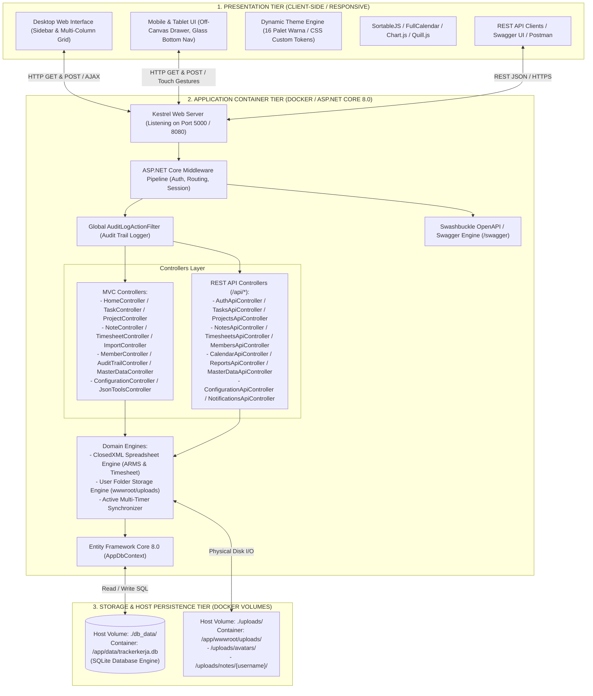
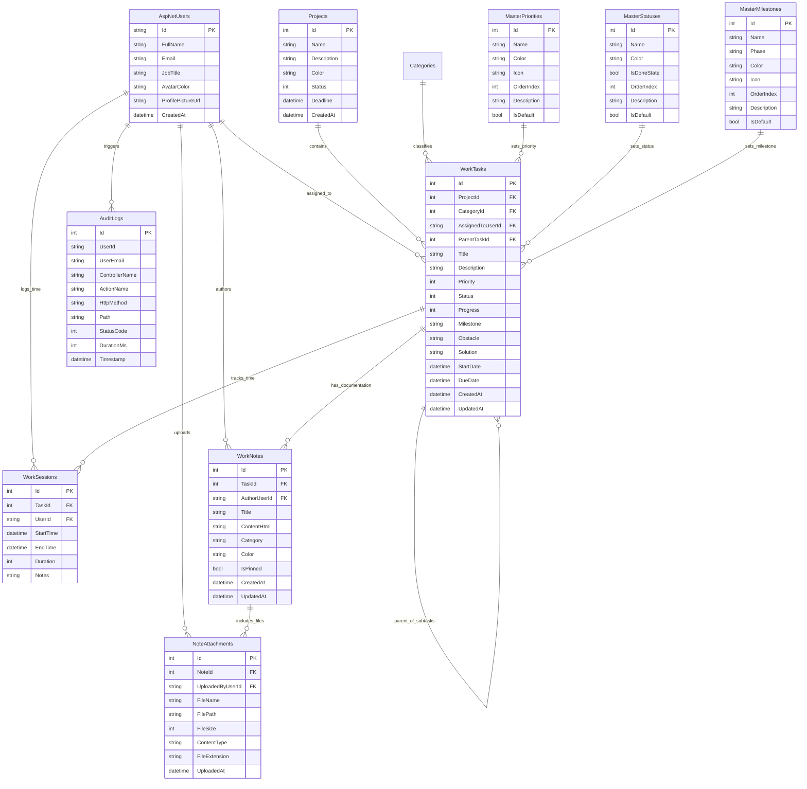

# DOKUMEN SPESIFIKASI FUNGSIONAL (FUNCTIONAL SPECIFICATION DOCUMENT - FSD)
## APLIKASI WORK TRACKER PRO (TRACKERKERJA)

---

### INFORMASI DOKUMEN
- **Nama Aplikasi**: Work Tracker Pro (TrackerKerja)
- **Versi Dokumen**: 3.1 (Docker & Enterprise Cloud Edition)
- **Status**: Disetujui & Terimplementasi Penuh (Production-Ready)
- **Target Platform**: Web Application (ASP.NET Core 8.0 MVC / REST API / Docker Linux Container)
- **Basis Data**: Entity Framework Core 8.0 dengan SQLite Database Engine (`/app/data/trackerkerja.db` via `./db_data` volume)
- **Engine Spreadsheet**: ClosedXML 0.104.2 (Format ARMS 21-kolom, Template Standar 9-kolom, & Timesheet Personal)
- **Dokumentasi REST API**: OpenAPI 3.0 via Swashbuckle Swagger UI (`/swagger`) & Postman Collection
- **Repositori Source Code**: [https://github.com/zhavick/TrackerKerja.git](https://github.com/zhavick/TrackerKerja.git)
- **Tanggal Rilis & Pembaruan**: 31 Agustus 2026

---

## DAFTAR ISI
1. [Pendahuluan & Lingkup Sistem](#1-pendahuluan--lingkup-sistem)
2. [Arsitektur Sistem & Infrastruktur Container](#2-arsitektur-sistem--infrastruktur-container)
3. [Entity Relationship Diagram (ERD) & Struktur Database](#3-entity-relationship-diagram-erd--struktur-database)
4. [Role-Based Access Control (RBAC) & Matriks Hak Akses](#4-role-based-access-control-rbac--matriks-hak-akses)
5. [Flow Proses & Spesifikasi Modul](#5-flow-proses--spesifikasi-modul)
   - [5.1 Modul Autentikasi & Profil Pengguna](#51-modul-autentikasi--profil-pengguna)
   - [5.2 Modul Sistem Desain Responsif & Mobile Navigation](#52-modul-sistem-desain-responsif--mobile-navigation)
   - [5.3 Modul Sistem Tema Tampilan Dinamis (16 Tema)](#53-modul-sistem-tema-tampilan-dinamis-16-tema)
   - [5.4 Modul Manajemen Proyek & Kategori](#54-modul-manajemen-proyek--kategori)
   - [5.5 Modul Manajemen Tugas & Struktur Parenting](#55-modul-manajemen-tugas--struktur-parenting)
   - [5.6 Modul Kanban Board Interaktif & Mobile Segmented Switcher](#56-modul-kanban-board-interaktif--mobile-segmented-switcher)
   - [5.7 Modul Timesheet, Multi-Timer Serentak & Laporan Personal Excel (.xlsx)](#57-modul-timesheet-multi-timer-serentak--laporan-personal-excel-xlsx)
   - [5.8 Modul Catatan & Multi-File Upload Terorganisir Folder Pengguna](#58-modul-catatan--multi-file-upload-terorganisir-folder-pengguna)
   - [5.9 Modul Import & Export Excel (Filter Periode, Format Standar, Format ARMS)](#59-modul-import--export-excel-filter-periode-format-standar-format-arms)
   - [5.10 Modul Anggota Tim (Member), Analitik Kontribusi & Admin Password Reset](#510-modul-anggota-tim-member-analitik-kontribusi--admin-password-reset)
   - [5.11 Modul Audit Trail & Aktivitas Sistem](#511-modul-audit-trail--aktivitas-sistem)
   - [5.12 Modul Master Data (Prioritas, Status & Milestone SDLC)](#512-modul-master-data-prioritas-status--milestone-sdlc)
   - [5.13 Modul RESTful API & Swagger OpenAPI Documentation](#513-modul-restful-api--swagger-openapi-documentation)
6. [Spesifikasi Non-Fungsional, Keamanan & Privasi Data](#6-spesifikasi-non-fungsional-keamanan--privasi-data)
7. [Panduan Docker Containerization, Git Repository & Deployment](#7-panduan-docker-containerization-git-repository--deployment)

---

## 1. PENDAHULUAN & LINGKUP SISTEM

### 1.1 Latar Belakang
**Work Tracker Pro (TrackerKerja)** adalah platform manajemen tugas kerja, pelacakan waktu (timesheet), dokumentasi teknis, dan analitik kinerja tim terintegrasi yang dirancang untuk mendukung operasional rekayasa perangkat lunak modern. Aplikasi dapat dijalankan secara mandiri (.NET runtime) maupun dikemas dalam container Docker Linux yang ringan, portable, dan siap produksi.

### 1.2 Tujuan Sistem
1. **Visibilitas Operasional Penuh**: Status tugas real-time, beban kerja tim, log kendala operasional (*Obstacle*), dan solusi teknis (*Solution*).
2. **Hierarki Tugas**: Relasi terstruktur antara tugas induk (*Parent Task*) dan sub-tugas (*Child Task*).
3. **Pencatatan Jam Kerja & Multi-Timer**: Pelacakan jam kerja fleksibel dengan kemampuan menjalankan multi-timer serentak per user serta ekspor laporan timesheet personal Excel multi-sheet terproteksi.
4. **Interoperabilitas Enterprise**: Pertukaran data spreadsheet format ARMS (21 kolom) dan format standar (9 kolom) dengan filter periode waktu dinamis.
5. **Responsivitas Multi-Device**: Antarmuka adaptif dengan off-canvas drawer, glassmorphic bottom bar, dan segmented kanban column switcher pada perangkat seluler.
6. **Ekosistem API Modern**: RESTful API lengkap (70+ endpoint) terdokumentasi OpenAPI Swagger v3.1 dan Postman Collection.
7. **Containerization & Cloud Ready**: Siap dioperasikan via Docker Compose dengan persistensi data SQLite dan file upload.

---

## 2. ARSITEKTUR SISTEM & INFRASTRUKTUR CONTAINER

Aplikasi dibangun menggunakan pola arsitektur **Multi-Tier Model-View-Controller (MVC) & RESTful Web API** yang di-enkapsulasi di dalam **Docker Container**:



---

## 3. ENTITY RELATIONSHIP DIAGRAM (ERD) & STRUKTUR DATABASE



---

## 4. ROLE-BASED ACCESS CONTROL (RBAC) & MATRIKS HAK AKSES

| Modul / Operasi | Administrator | System Analyst | Technical Writer | User Biasa |
| :--- | :---: | :---: | :---: | :---: |
| **Login, Profil & Dashboard** | ✅ Akses Penuh | ✅ Akses | ✅ Akses | ✅ Akses |
| **Buat Tugas Baru** | ✅ Akses Penuh | ✅ Akses | ✅ Akses | ✅ Akses |
| **Ubah Tugas Sendiri** | ✅ Akses Penuh | ✅ Akses | ✅ Akses | ✅ Akses |
| **Ubah Tugas Anggota Lain** | ✅ Akses Penuh | ✅ Akses *(Elevated)* | ✅ Akses *(Elevated)* | ❌ Dilarang |
| **Mulai Timer pada Tugas Lain**| ✅ Akses Penuh | ✅ Akses *(Elevated)* | ✅ Akses *(Elevated)* | ❌ Dilarang |
| **Multi-Timer Serentak Sendiri**| ✅ Akses Penuh | ✅ Akses | ✅ Akses | ✅ Akses |
| **Ekspor Timesheet Personal** | ✅ Akses Penuh | ✅ Akses | ✅ Akses | ✅ Akses |
| **Hapus Tugas Sendiri** | ✅ Akses Penuh | ✅ Akses | ✅ Akses | ✅ Akses |
| **Hapus Tugas Orang Lain** | ✅ Akses Penuh | ❌ Dilarang | ❌ Dilarang | ❌ Dilarang |
| **Ekspor Excel (Standard & ARMS)**| ✅ Akses Penuh | ✅ Akses | ✅ Akses | ✅ Akses |
| **Manajemen Proyek (CRUD)** | ✅ Akses Penuh | ❌ Dilarang | ❌ Dilarang | ❌ Dilarang |
| **Import Tugas Excel** | ✅ Akses Penuh | ❌ Dilarang | ❌ Dilarang | ❌ Dilarang |
| **Manajemen Member & Reset Password**| ✅ Akses Penuh | ❌ Dilarang | ❌ Dilarang | ❌ Dilarang |
| **Master Data (Prioritas, Status, SDLC)**| ✅ Akses Penuh | ❌ Dilarang | ❌ Dilarang | ❌ Dilarang |
| **Konfigurasi & Audit Trail**| ✅ Akses Penuh | ❌ Dilarang | ❌ Dilarang | ❌ Dilarang |

---

## 5. FLOW PROSES & SPESIFIKASI MODUL

### 5.1 Modul Autentikasi & Profil Pengguna
- Menggunakan **ASP.NET Core Identity** dengan penyimpanan terintegrasi EF Core SQLite.
- Manajemen password, lockout policies, dan cookie session persistence 7 hari (*Sliding Expiration*).
- Upload foto avatar unik tersimpan di direktori `wwwroot/uploads/avatars/`.

### 5.2 Modul Sistem Desain Responsif & Mobile Navigation
- **Off-Canvas Drawer Navigation**: Menggantikan sidebar pada layar `< 1024px` dengan transisi halus dan latar belakang *backdrop blur*.
- **Glassmorphic Bottom Navigation**: Navigasi bawah melayang khusus smartphone dengan 5 tombol utama (*Home*, *Tugas*, *Elevated +*, *Proyek*, *Menu*).
- **Safe Area Inset**: Mengakomodasi gesture navigation dan notch smartphone modern.

### 5.3 Modul Sistem Tema Tampilan Dinamis (16 Tema)
- **10 Tema Terang**: *Indigo Nebula* (Default), *Emerald Forest*, *Ocean Azure*, *Sunset Crimson*, *Cyberpunk Neon*, *Royal Amethyst*, *Amber Gold*, *Slate Minimalist*, *Nordic Teal*, *Midnight Titanium*.
- **6 Tema Gelap**: *Midnight OLED*, *Cyberpunk Synthwave*, *Emerald Matrix*, *Dracula Eclipse*, *Abyssal Ocean*, *Solar Ember*.
- Dikelola melalui CSS Custom Property Token System (`themes.css`) tanpa reload halaman.

### 5.4 Modul Manajemen Proyek & Kategori
- Pengelompokan tugas berdasarkan proyek multi-bulan dan kategori pekerjaan teknis.
- Perhitungan agregasi progress penyelesaian proyek secara dinamis.

### 5.5 Modul Manajemen Tugas & Struktur Parenting
- **Parent-Child Hierarchy**: Kemampuan menghubungkan sub-tugas ke tugas induk.
- **Log Kendala & Solusi**: Kolom `Obstacle` dan `Solution` untuk dokumentasi teknis hambatan kerja.
- **Progress Slider (0–100%)**: Tombol cepat (0%, 25%, 50%, 75%, 100%) dengan auto-sync status *Done*.
- **Filter Periode Ekspor**: Ekspor tugas berdasarkan rentang waktu fleksibel (*Today, Yesterday, Last 7 Days, Last 30 Days, This Month, Last Month, Custom*).

### 5.6 Modul Kanban Board Interaktif & Mobile Segmented Switcher
- Papan visual bertenaga **SortableJS** dengan drag-and-drop kartu real-time.
- **Mobile Segmented Switcher**: Tab pil (`📋 Todo`, `🔄 In Progress`, `🔍 Review`, `✅ Done`) pada smartphone untuk kemudahan akses kolom tanpa horizontal scrolling.

### 5.7 Modul Timesheet, Multi-Timer Serentak & Laporan Personal Excel (.xlsx)
- **Multi-Timer Serentak**: Kolom `UserId` pada `WorkSessions` memastikan pengguna dapat mengaktifkan beberapa timer tugas secara bersamaan tanpa saling mengganggu.
- **Laporan Timesheet Personal (ClosedXML)**:
  - **Sheet 1 ("Timesheet Personal")**: Informasi metadata karyawan, tabel rincian sesi harian, dan formula otomatis `=SUM(...)`.
  - **Sheet 2 ("Rekap per Proyek")**: Ringkasan alokasi waktu dan persentase kontribusi per proyek.
  - **Proteksi Privasi**: Non-admin hanya dapat mengunduh rekaman waktu miliknya sendiri.

### 5.8 Modul Catatan & Multi-File Upload Terorganisir Folder Pengguna
- Editor teks kaya WYSIWYG bertenaga **Quill.js**.
- Lampiran berkas multi-file diisolasi rapi pada folder `wwwroot/uploads/notes/{username}/`.
- Format penamaan file fisik unik `{yyyyMMdd_HHmmss}_{GUID8}_{CleanFileName}.ext`.

### 5.9 Modul Import & Export Excel (Filter Periode, Format Standar, Format ARMS)
- **Format Standar (9 Kolom)**: Fitur wizard preview interaktif dan penugasan PIC massal (*Bulk Assign*).
- **Format ARMS Enterprise (21 Kolom)**: Ekspor dan impor tugas berstandar enterprise dengan pemetaan SDLC Waterfall Milestone.

### 5.10 Modul Anggota Tim (Member), Analitik Kontribusi & Admin Password Reset
- Kartu direktori anggota dengan grafik kontribusi dan jam kerja.
- **Admin Direct Password Reset**: Administrator dapat mereset kata sandi anggota tim secara langsung via Web UI atau REST API `POST /api/members/{id}/reset-password`.

### 5.11 Modul Audit Trail & Aktivitas Sistem
- Pencatatan otomatis seluruh aktivitas controller via `AuditLogActionFilter`.
- Visualisasi grafik multi-series tren aktivitas dan ekspor audit log ke CSV.

### 5.12 Modul Master Data (Prioritas, Status & Milestone SDLC)
- Pengelolaan referensi Master Prioritas, Master Status, Kategori, dan Master Milestone SDLC Waterfall (*Requirement Analysis*, *System Design*, *Implementation*, *Testing & QA*, *Deployment*, *Maintenance*).

### 5.13 Modul RESTful API & Swagger OpenAPI Documentation
- 70+ endpoint RESTful dengan respons terstandarisasi JSON:
```json
{
  "success": true,
  "message": "Operation description",
  "data": { },
  "errors": null,
  "timestamp": "2026-08-31T09:00:00Z"
}
```
- Swagger UI interaktif di `/swagger` dan berkas Postman Collection & Environment.

---

## 6. SPESIFIKASI NON-FUNGSIONAL, KEAMANAN & PRIVASI DATA

### 6.1 Keamanan & Proteksi Data
1. **Anti-CSRF Protection**: Form mutasi state dilindungi token `@Html.AntiForgeryToken()`.
2. **Role-Based Authorization**: Filter `[Authorize(Roles = "Admin")]` dan verifikasi hak akses berbasis job title.
3. **Pencegahan SQL Injection**: Seluruh akses database menggunakan parameterized LINQ queries EF Core.
4. **Sanitasi Path & File Storage**: Proteksi path traversal (`../`) dan validasi MIME type serta ekstensi file upload.
5. **Data Protection & Secret Handling**: Enkripsi cookie session dan token autentikasi.

### 6.2 Performa & Keandalan
1. **Index Optimization**: Indeks database pada `Tasks.ProjectId`, `Tasks.AssignedToUserId`, `Tasks.ParentTaskId`, dan `AuditLogs.Timestamp`.
2. **Efisiensi File Streaming**: Endpoint download berkas menggunakan `PhysicalFileResult` stream native ASP.NET Core.
3. **SQLite Database Compaction**: Fitur *Shrink Database (VACUUM)* untuk menjaga ukuran file basis data tetap ringkas.

---

## 7. PANDUAN DOCKER CONTAINERIZATION, GIT REPOSITORY & DEPLOYMENT

### 7.1 Multi-Stage Dockerfile
Aplikasi dikompilasi menggunakan multi-stage build resmi Microsoft:
- **Build Stage**: `mcr.microsoft.com/dotnet/sdk:8.0` (NuGet restore & Release build).
- **Runtime Stage**: `mcr.microsoft.com/dotnet/aspnet:8.0` (Ukuran image ringan & aman).
- **Binding Port**: `http://+:5000` dan `http://+:8080`.

### 7.2 Docker Compose & Persistent Volumes
```yaml
services:
  trackerkerja:
    image: trackerkerja:latest
    build:
      context: .
      dockerfile: Dockerfile
    container_name: trackerkerja_app
    restart: unless-stopped
    ports:
      - "5000:5000"
    environment:
      - ASPNETCORE_ENVIRONMENT=Production
      - ASPNETCORE_URLS=http://+:5000
      - ConnectionStrings__DefaultConnection=Data Source=data/trackerkerja.db
      - GlobalBaseUrl=http://localhost:5000
    volumes:
      - ./db_data:/app/data
      - ./uploads:/app/wwwroot/uploads
```

### 7.3 Perintah Menjalankan Aplikasi

#### 1. Via Docker Compose:
```bash
docker compose up -d --build
```

#### 2. Via PowerShell Script Helper (Windows):
```powershell
.\docker-run.ps1 init-data
.\docker-run.ps1 up
```

#### 3. Via .NET CLI (Development):
```bash
dotnet run --urls=http://localhost:5000
```

---

### 7.4 Repositori GitHub & Sinkronisasi Kode

- **URL Repositori**: 👉 **`https://github.com/zhavick/TrackerKerja.git`**
- **Branch Utama**: `main`
- **Script Push Otomatis**:
```powershell
.\git-push.ps1
```

---

### 📦 Berkas Referensi Terkait
- **Dokumentasi Pengguna**: [USER_GUIDE.md](file:///c:/TEMP/VSCODE/TrackerKerja/USER_GUIDE.md)
- **Panduan Docker**: [DOCKER_GUIDE.md](file:///c:/TEMP/VSCODE/TrackerKerja/DOCKER_GUIDE.md)
- **Ringkasan Proyek**: [README.md](file:///c:/TEMP/VSCODE/TrackerKerja/README.md)
- **Postman Collection**: `TrackerKerja_Postman_Collection.json`
- **Postman Environment**: `TrackerKerja_Postman_Environment.json`
