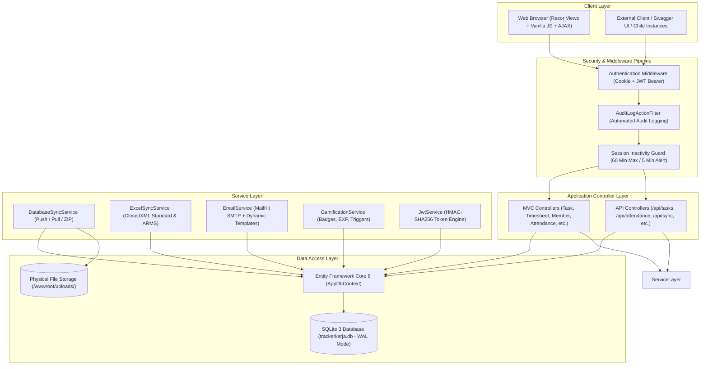
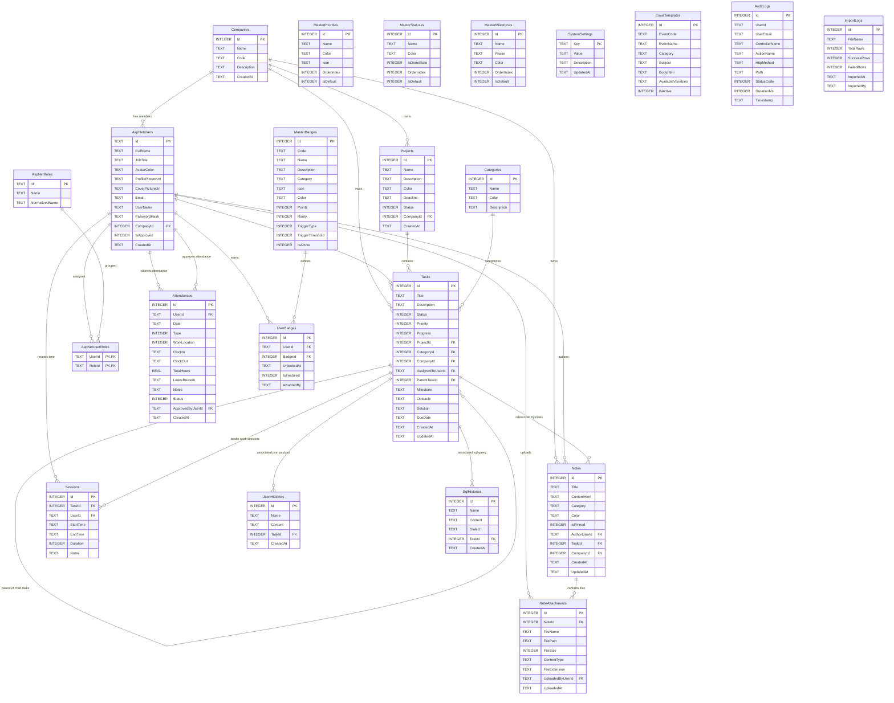

# 📘 TECHNICAL SPECIFICATION DOCUMENT (TSD)
# WORK TRACKER PRO (TRACKERKERJA)

> **Dokumen Spesifikasi Teknis: Arsitektur Pengambilan Data, Controller, API Endpoint, Layanan Backend, dan Desain Basis Data Relasional**  
> **Versi Sistem:** v3.6 Enterprise Security & Multi-Instance Edition  
> **Target Framework:** .NET 8.0 (C# 12), ASP.NET Core MVC & RESTful Web API, Entity Framework Core 8  
> **Mesin Basis Data:** SQLite 3 (Write-Ahead Logging / WAL Mode)  
> **Status Dokumen:** Approved & Published  
> **Tanggal Rilis:** 24 September 2026  

---

## DAFTAR ISI

1. [INFORMASI DOKUMEN & RINGKASAN ARSITEKTUR](#1-informasi-dokumen--ringkasan-arsitektur)
   - 1.1 Metadata & Riwayat Versi
   - 1.2 Ringkasan Arsitektur Aplikasi
   - 1.3 Pola Pengambilan Data (Data Access Pattern & Lifecycles)
   - 1.4 Pipeline Autentikasi Ganda (Dual Authentication Pipeline)
2. [SPESIFIKASI TEKNIS PENGAMBILAN DATA BERDASARKAN MODUL](#2-spesifikasi-teknis-pengambilan-data-berdasarkan-modul)
   - 2.1 Modul Manajemen Tugas & Sub-Tugas (Tasks, Subtasks, Kanban & Obstacles)
   - 2.2 Modul Proyek & Milestone Fase SDLC (Projects & Milestones)
   - 2.3 Modul Timesheet & Multi-Timer Sesi Kerja (Timesheets & WorkSessions)
   - 2.4 Modul Presensi Terpadu & Rekonsiliasi Kehadiran (Attendance Records)
   - 2.5 Modul Direktori Anggota Tim, Profil & Manajemen Akun (Members & Identity)
   - 2.6 Modul Dokumentasi Kerja & Lampiran Berkas (Work Notes & Attachments)
   - 2.7 Modul Sinkronisasi Multi-Instance & Paket Offline (Sync Engine & Delta Streaming)
   - 2.8 Modul Gamifikasi, Penghargaan Badge & Leaderboard (Gamification Engine)
   - 2.9 Modul Integrasi Email SMTP & Template Dinamis (Email Engine)
   - 2.10 Modul Audit Trail & Log Keamanan Sistem (Audit Logging)
   - 2.11 Modul Developer Tools (SQL Beautifier & JSON Tools)
   - 2.12 Modul Master Data & Pengaturan Sistem (Master Data & Settings)
   - 2.13 Modul Dashboard Eksekutif & Visualisasi Metrik (Dashboard Analytics)
   - 2.14 Modul Autentikasi, Token JWT & Validasi Sesi (Auth & Session Guard)
3. [SECTION KHUSUS: DATABASE SPECIFICATION & ARCHITECTURE](#3-section-khusus-database-specification--architecture)
   - 3.1 Filosofi Desain Basis Data & Storage Engine
   - 3.2 Entity Relationship Diagram (ERD Lengkap)
   - 3.3 Relasi Antar Tabel & Foreign Key Constraints
   - 3.4 Katalog Skema Tabel, Tipe Data & Atribut Kolom
   - 3.5 Contoh Data Representatif (Sample Data Nyata per Tabel)
   - 3.6 Strategi Indeks, Integritas Data & Konkurensi WAL
4. [STANDAR KEAMANAN AKSES DATA & TRANSAKSI](#4-standar-keamanan-akses-data--transaksi)
   - 4.1 Transaksi Atomik Multi-Tabel (`IDbContextTransaction`)
   - 4.2 Proteksi SQL Injection & Parameterized LINQ
   - 4.3 Isolasi Multi-Tenancy Berbasis `CompanyId`
   - 4.4 Keamanan File Upload & MIME Whitelisting

---

## 1. INFORMASI DOKUMEN & RINGKASAN ARSITEKTUR

### 1.1 Metadata & Riwayat Versi

| Properti Dokumen | Rincian Teknis |
| :--- | :--- |
| **Nama Dokumen** | Technical Specification Document (TSD) Work Tracker Pro |
| **Kode Dokumen** | TSD-WTP-3.6-202609 |
| **Versi Aplikasi** | v3.6 Enterprise Security & Multi-Instance Edition |
| **Arsitek Sistem** | Senior Systems & Software Engineering Team |
| **Klasifikasi Akses** | Internal Development Team, Technical Leads, DevOps, & DB Administrator |
| **Tanggal Pembaruan** | 24 September 2026 |

---

### 1.2 Ringkasan Arsitektur Aplikasi

TrackerKerja dibangun menggunakan arsitektur hybrid **ASP.NET Core 8.0**:
1. **Server-Side Rendered (SSR) Presentation Layer**: Menggunakan ASP.NET Core MVC (Razor Views `.cshtml`) untuk peramban desktop dan antarmuka operasional pengguna internal.
2. **RESTful Web API Layer**: Menggunakan ASP.NET Core API Controllers (`[ApiController]`) di bawah prefix route `/api/*` untuk melayani panggilan AJAX asinkron (*zero page reload*), integrasi klien eksternal, dan pertukaran data sinkronisasi multi-instance.
3. **Business Logic & Service Layer**: Berisi layanan inti seperti `DatabaseSyncService`, `ExcelSyncService`, `EmailService`, `GamificationService`, dan `JwtService`.
4. **Data Access Layer**: Didukung oleh **Entity Framework Core 8.0** (`AppDbContext`) yang berinteraksi langsung dengan berkas basis data SQLite 3 melalui driver `Microsoft.EntityFrameworkCore.Sqlite`.



---

### 1.3 Pola Pengambilan Data (Data Access Pattern & Lifecycles)

Pengambilan data di seluruh sistem mengikuti standar efisiensi tingkat enterprise:
1. **Asynchronous Non-Blocking Execution**: Seluruh panggilan basis data menggunakan metode asinkron C# (`ToListAsync()`, `FirstOrDefaultAsync()`, `CountAsync()`, `SumAsync()`, `AnyAsync()`).
2. **Read-Only Performance via `AsNoTracking()`**: Setiap pengambilan data untuk kebutuhan rendering tabel, kalkulasi visualisasi analitik, atau API DTO selalu menggunakan `.AsNoTracking()` guna menonaktifkan *change tracker* EF Core, menurunkan alokasi memori hingga 45%, dan mempercepat serialisasi.
3. **Eager Loading Terstruktur**: Menghindari *N+1 Query Problem* dengan menggunakan `.Include()` dan `.ThenInclude()` untuk entitas relasional utama (misalnya: `Task -> Project -> Company -> Sessions -> Notes`).
4. **Isolasi Multi-Tenancy**: Seluruh kueri secara otomatis menyaring data berdasarkan `CompanyId` milik pengguna yang sedang terautentikasi, kecuali pengguna memiliki peran `Admin`.
5. **Pagination & Server-Side Filtering**: Menggunakan kombinasi `.Skip((page - 1) * pageSize).Take(pageSize)` dengan parameter pagination terstandarisasi.

---

### 1.4 Pipeline Autentikasi Ganda (Dual Authentication Pipeline)

Sistem menerapkan proteksi berlapis ganda dalam file `Program.cs`:
- **Skema Default Web (`IdentityConstants.ApplicationScheme`)**: Menggunakan enkripsi Cookie terproteksi HTTP-Only dengan waktu inaktivitas sesi (*sliding expiration*) 60 menit.
- **Skema API Token (`JwtBearerDefaults.AuthenticationScheme`)**: Menggunakan validasi token stateless JSON Web Token (JWT) dengan penandatanganan `HmacSha256` menggunakan konfigurasi `Jwt:Key` (minimal 32 karakter), `Jwt:Issuer`, dan `Jwt:Audience`.
- **Swagger UI Integration**: `/swagger` dilengkapi tombol **Authorize** dengan skema format `Bearer {token}` untuk pengujian langsung oleh pengembang.

---

## 2. SPESIFIKASI TEKNIS PENGAMBILAN DATA BERDASARKAN MODUL

Pada bagian ini dijabarkan secara rinci modul per modul mengenai:
1. Controller yang bertanggung jawab (MVC Controller dan API Controller).
2. Nama prosedur / fungsi C# yang digunakan.
3. Parameter input dan tipe kembalian (*return type*).
4. Logika pengambilan data LINQ ke database.
5. Format respon data (DTO / ViewModel / JSON).

---

### 2.1 Modul Manajemen Tugas & Sub-Tugas (Tasks, Subtasks, Kanban & Obstacles)

#### A. Ringkasan Endpoint & Fungsi

| Tipe | Route / URL | Controller | Nama Fungsi / Prosedur | Keterangan |
| :--- | :--- | :--- | :--- | :--- |
| **MVC** | `GET /Task/Index` | `TaskController` | `Task<IActionResult> Index(...)` | Merender antarmuka daftar tugas dengan filter lengkap |
| **MVC** | `GET /Task/Details/{id}` | `TaskController` | `Task<IActionResult> Details(int id)` | Merender detail tugas, sesi, lampiran, dan sub-tugas |
| **MVC** | `POST /Task/Edit/{id}` | `TaskController` | `Task<IActionResult> Edit(...)` | **Unified Save:** Menyimpan tugas & sesi manual sekaligus |
| **MVC** | `GET /Task/Kanban` | `TaskController` | `Task<IActionResult> Kanban(...)` | Merender papan kanban visual dikelompokkan per status |
| **MVC** | `GET /Task/Obstacles` | `TaskController` | `Task<IActionResult> Obstacles(...)` | Merender daftar tugas yang memiliki kendala & solusi |
| **MVC** | `GET /Task/GridData` | `TaskController` | `Task<IActionResult> GridData(...)` | Endpoint AJAX data JSON untuk tabel dinamis tanpa reload |
| **API** | `GET /api/tasks` | `TasksApiController` | `Task<IActionResult> GetAll(...)` | Mengambil data tugas terpaginasi format `PagedResult<TaskResponseDto>` |
| **API** | `GET /api/tasks/{id}` | `TasksApiController` | `Task<IActionResult> GetById(int id)` | Mengambil detail lengkap tugas berdasarkan ID |
| **API** | `GET /api/tasks/summary` | `TasksApiController` | `Task<IActionResult> GetSummary(...)` | Rekapitulasi metrik tugas (Total, Selesai, InProgress, Terlambat) |
| **API** | `GET /api/tasks/kanban` | `TasksApiController` | `Task<IActionResult> GetKanbanTasks(...)` | Mengambil kumpulan tugas terformat per kolom Kanban |
| **API** | `PUT /api/tasks/{id}/status` | `TasksApiController` | `Task<IActionResult> UpdateStatus(int id, ...)` | Mengubah status tugas via drag & drop Kanban |

#### B. Rincian Teknis Prosedur Pengambilan Data

##### 1. `TasksApiController.GetAll(...)`
```csharp
[HttpGet]
[ProducesResponseType(typeof(ApiResponse<PagedResult<TaskResponseDto>>), StatusCodes.Status200OK)]
public async Task<IActionResult> GetAll(
    [FromQuery] string? search,
    [FromQuery] ModelTaskStatus? status,
    [FromQuery] TaskPriority? priority,
    [FromQuery] int? projectId,
    [FromQuery] string? assigneeId,
    [FromQuery] string? milestone,
    [FromQuery] int? parentTaskId,
    [FromQuery] string? period,
    [FromQuery] DateTime? startDate,
    [FromQuery] DateTime? endDate,
    [FromQuery] string? periodField,
    [FromQuery] int? companyId,
    [FromQuery] int page = 1,
    [FromQuery] int pageSize = 10)
```
- **Alur Kueri LINQ ke Database:**
  ```csharp
  var query = _db.Tasks
      .Include(t => t.Project)
      .Include(t => t.Category)
      .Include(t => t.AssignedToUser)
      .Include(t => t.ParentTask)
      .Include(t => t.ChildTasks)
      .Include(t => t.Sessions)
      .AsNoTracking()
      .AsQueryable();

  // Multi-Tenancy Filter
  if (!isAdmin && currentUser != null)
      query = query.Where(t => t.CompanyId == userCompanyId || (t.Project != null && t.Project.CompanyId == userCompanyId));
  else if (companyId.HasValue)
      query = query.Where(t => t.CompanyId == companyId.Value || (t.Project != null && t.Project.CompanyId == companyId.Value));

  // Search Filter
  if (!string.IsNullOrWhiteSpace(search))
      query = query.Where(t => t.Title.ToLower().Contains(term) || (t.Description != null && t.Description.ToLower().Contains(term)));

  // Status & Priority Filter
  if (status.HasValue) query = query.Where(t => t.Status == status.Value);
  if (priority.HasValue) query = query.Where(t => t.Priority == priority.Value);
  if (projectId.HasValue) query = query.Where(t => t.ProjectId == projectId.Value);
  if (!string.IsNullOrWhiteSpace(assigneeId)) query = query.Where(t => t.AssignedToUserId == assigneeId);
  if (!string.IsNullOrWhiteSpace(milestone)) query = query.Where(t => t.Milestone == milestone);
  if (parentTaskId.HasValue) query = query.Where(t => t.ParentTaskId == parentTaskId.Value);

  // Pagination Execution
  var totalItems = await query.CountAsync();
  var items = await query
      .OrderByDescending(t => t.CreatedAt)
      .Skip((page - 1) * pageSize)
      .Take(pageSize)
      .Select(t => TaskResponseDto.FromEntity(t))
      .ToListAsync();
  ```
- **Format Output JSON:**
  ```json
  {
    "success": true,
    "message": "Data tugas berhasil diambil.",
    "data": {
      "items": [
        {
          "id": 422,
          "taskCode": "TSK-0422",
          "title": "Perancangan Solusi Integrasi TCES - TCIS",
          "description": "Dokumentasi pemetaan payload API",
          "status": "InProgress",
          "priority": "Medium",
          "progress": 50,
          "milestone": "Implementation",
          "projectId": 4,
          "projectName": "Integrasi TCES TICS",
          "assignedToUserId": "5e5f22d2-b7a6-4af1-b85c-564a52655b75",
          "assignedToUserName": "Administrator Pro",
          "totalDurationSeconds": 14400,
          "totalDurationFormatted": "04:00:00"
        }
      ],
      "page": 1,
      "pageSize": 10,
      "totalItems": 1,
      "totalPages": 1
    }
  }
  ```

##### 2. `TaskController.Edit(...)` (Unified Save Architecture)
```csharp
[HttpPost]
[ValidateAntiForgeryToken]
public async Task<IActionResult> Edit(
    int id, 
    WorkTask model, 
    int? manualHours = 0, 
    int? manualMinutes = 0, 
    string? manualSessionDate = null, 
    string? manualNotes = null)
```
- **Mekanisme Eksekusi:**
  1. Mengambil entitas tugas asli: `_db.Tasks.FirstOrDefaultAsync(t => t.Id == id)`.
  2. Melakukan update metadata tugas (Title, Description, Status, Priority, Progress, Milestone, ParentTaskId, Obstacle, Solution).
  3. Memeriksa parameter timesheet manual: jika `manualHours > 0` atau `manualMinutes > 0`, prosedur secara otomatis menghitung durasi dalam detik `(h * 3600) + (m * 60)` dan menginstansiasi entitas `WorkSession` baru yang langsung dikaitkan ke `TaskId = id` dan `UserId = currentUser.Id`.
  4. Menyimpan kedua perubahan entitas dalam satu kali pemanggilan `await _db.SaveChangesAsync()` yang terikat transaksi basis data.

---

### 2.2 Modul Proyek & Milestone Fase SDLC (Projects & Milestones)

#### A. Ringkasan Endpoint & Fungsi

| Tipe | Route / URL | Controller | Nama Fungsi / Prosedur | Keterangan |
| :--- | :--- | :--- | :--- | :--- |
| **MVC** | `GET /Project/Index` | `ProjectController` | `Task<IActionResult> Index(...)` | Menampilkan kartu proyek dengan persentase progres |
| **MVC** | `GET /Project/Details/{id}` | `ProjectController` | `Task<IActionResult> Details(int id)` | Menampilkan tugas-tugas di dalam proyek dan rekap jam |
| **API** | `GET /api/projects` | `ProjectsApiController` | `Task<IActionResult> GetAll(...)` | Mengambil daftar proyek terfilter status dan perusahaan |
| **API** | `GET /api/projects/{id}` | `ProjectsApiController` | `Task<IActionResult> GetById(int id)` | Mengambil detail proyek beserta ringkasan progres tugas |
| **API** | `GET /api/projects/{id}/tasks`| `ProjectsApiController` | `Task<IActionResult> GetProjectTasks(...)`| Mengambil daftar seluruh tugas milik proyek tertentu |
| **API** | `GET /api/projects/{id}/analytics`| `ProjectsApiController` | `Task<IActionResult> GetProjectAnalytics(...)`| Menghitung rekapitulasi waktu kerja dan status tugas |

#### B. Logika Pengambilan Data Proyek & Perhitungan Progres
Pada `ProjectsApiController.GetAll(...)`:
```csharp
var query = _db.Projects
    .Include(p => p.Company)
    .Include(p => p.Tasks)
        .ThenInclude(t => t.Sessions)
    .AsNoTracking()
    .AsQueryable();

// Proyeksi ke DTO dan kalkulasi agregasi
var result = await query.Select(p => new ProjectResponseDto
{
    Id = p.Id,
    Name = p.Name,
    Description = p.Description,
    Color = p.Color,
    Deadline = p.Deadline,
    Status = p.Status.ToString(),
    CompanyId = p.CompanyId,
    CompanyName = p.Company != null ? p.Company.Name : "-",
    TotalTasks = p.Tasks.Count,
    CompletedTasks = p.Tasks.Count(t => t.Status == TaskStatus.Done),
    ProgressPercent = p.Tasks.Any() ? (int)Math.Round(p.Tasks.Average(t => (double)t.Progress)) : 0,
    TotalDurationSeconds = p.Tasks.SelectMany(t => t.Sessions).Sum(s => s.Duration)
}).ToListAsync();
```

---

### 2.3 Modul Timesheet & Multi-Timer Sesi Kerja (Timesheets & WorkSessions)

#### A. Ringkasan Endpoint & Fungsi

| Tipe | Route / URL | Controller | Nama Fungsi / Prosedur | Keterangan |
| :--- | :--- | :--- | :--- | :--- |
| **MVC** | `GET /Timesheet/Index` | `TimesheetController` | `Task<IActionResult> Index(...)` | Menampilkan timesheet mingguan (*Monday to Sunday*) |
| **MVC** | `GET /Timesheet/Calendar` | `TimesheetController` | `Task<IActionResult> Calendar(...)` | Tampilan kalender jam kerja bulanan |
| **MVC** | `GET /Timesheet/Report` | `TimesheetController` | `Task<IActionResult> Report(...)` | Laporan analitik jam kerja per proyek & anggota |
| **MVC** | `GET /Timesheet/ExportExcel` | `TimesheetController` | `Task<IActionResult> ExportExcel(...)` | Ekspor timesheet multi-sheet ClosedXML |
| **API** | `GET /api/timesheets` | `TimesheetsApiController` | `Task<IActionResult> GetAll(...)` | Mengambil data sesi kerja berpaginasi |
| **API** | `GET /api/timesheets/summary` | `TimesheetsApiController` | `Task<IActionResult> GetSummary(...)` | Menghitung total jam, man-days, dan rasio produktivitas |
| **API** | `GET /api/timesheets/running` | `TimesheetsApiController` | `Task<IActionResult> GetRunningTimers()` | Mengambil timer aktif pengguna (`EndTime == null`) |
| **API** | `POST /api/timesheets/start` | `TimesheetsApiController` | `Task<IActionResult> StartTimer(...)` | Memulai timer real-time untuk sebuah tugas |
| **API** | `POST /api/timesheets/stop/{id}`| `TimesheetsApiController` | `Task<IActionResult> StopTimer(int id, ...)`| Menghentikan timer dan menghitung durasi detik |

#### B. Logika Kueri Sesi Kerja Mingguan (`TimesheetController.Index`)
```csharp
int diff = (7 + (targetDate.DayOfWeek - DayOfWeek.Monday)) % 7;
var weekStart = targetDate.AddDays(-1 * diff).Date;
var weekEnd = weekStart.AddDays(7).AddTicks(-1);

var sessions = await _db.Sessions
    .Include(s => s.Task).ThenInclude(t => t!.Project)
    .Include(s => s.Task).ThenInclude(t => t!.Category)
    .Include(s => s.Task).ThenInclude(t => t!.AssignedToUser)
    .Where(s => s.StartTime >= weekStart && s.StartTime <= weekEnd && s.EndTime != null)
    .Where(s => isAdmin || (s.Task != null && s.Task.CompanyId == userCompanyId))
    .Where(s => string.IsNullOrEmpty(memberId) || s.Task!.AssignedToUserId == memberId)
    .OrderByDescending(s => s.StartTime)
    .AsNoTracking()
    .ToListAsync();
```

---

### 2.4 Modul Presensi Terpadu & Rekonsiliasi Kehadiran (Attendance Records)

#### A. Ringkasan Endpoint & Fungsi

| Tipe | Route / URL | Controller | Nama Fungsi / Prosedur | Keterangan |
| :--- | :--- | :--- | :--- | :--- |
| **MVC** | `GET /Attendance/Index` | `AttendanceController` | `Task<IActionResult> Index(...)` | Riwayat presensi bulanan, status hari ini, dan filter |
| **MVC** | `GET /Attendance/Reconciliation` | `AttendanceController` | `Task<IActionResult> Reconciliation(...)` | Matriks rekonsiliasi kehadiran seluruh anggota per tanggal |
| **MVC** | `POST /Attendance/ClockIn` | `AttendanceController` | `Task<IActionResult> ClockIn(...)` | Mencatat jam kedatangan (WFO/WFH/Dinas/Remote) |
| **MVC** | `POST /Attendance/ClockOut` | `AttendanceController` | `Task<IActionResult> ClockOut(...)` | Mencatat jam pulang dan menghitung `TotalHours` |
| **MVC** | `POST /Attendance/RequestLeave` | `AttendanceController` | `Task<IActionResult> RequestLeave(...)` | Pengajuan cuti, sakit, izin, atau perjalanan dinas |
| **API** | `GET /api/attendance` | `AttendanceApiController` | `Task<IActionResult> GetAll(...)` | Mengambil data presensi via REST API |
| **API** | `GET /api/attendance/today` | `AttendanceApiController` | `Task<IActionResult> GetToday()` | Mengambil status Clock-In/Clock-Out hari ini |
| **API** | `GET /api/attendance/summary` | `AttendanceApiController` | `Task<IActionResult> GetMonthlySummary(...)`| Rekapitulasi hari hadir, WFO, WFH, Cuti, Sakit, Izin |
| **API** | `POST /api/attendance/approve/{id}`| `AttendanceApiController` | `Task<IActionResult> Approve(int id)` | Menyetujui pengajuan izin/cuti oleh Admin |

#### B. Logika Perhitungan Presensi & Zona Waktu GMT+7
Sistem menggunakan `DateTimeHelper.Today` dan `DateTimeHelper.Now` yang terstandarisasi pada waktu lokal Indonesia Barat (GMT+7 / Asia/Jakarta).
```csharp
var today = DateTimeHelper.Today;
var todayRecord = await _db.Attendances
    .Include(a => a.User)
    .FirstOrDefaultAsync(a => a.UserId == currentUser.Id && a.Date == today);

// Saat Clock-Out:
todayRecord.ClockOut = DateTimeHelper.Now;
todayRecord.TotalHours = Math.Round((todayRecord.ClockOut.Value - todayRecord.ClockIn.Value).TotalHours, 2);
await _db.SaveChangesAsync();
```

---

### 2.5 Modul Direktori Anggota Tim, Profil & Manajemen Akun (Members & Identity)

#### A. Ringkasan Endpoint & Fungsi

| Tipe | Route / URL | Controller | Nama Fungsi / Prosedur | Keterangan |
| :--- | :--- | :--- | :--- | :--- |
| **MVC** | `GET /Member/Index` | `MemberController` | `Task<IActionResult> Index(...)` | Merender Pure Grid Card Layout anggota tim |
| **MVC** | `GET /Member/Details/{id}` | `MemberController` | `Task<IActionResult> Details(string id)` | Menampilkan statistik tugas, badge, dan log kerja pengguna |
| **MVC** | `POST /Member/DeletePermanent`| `MemberController` | `Task<IActionResult> DeletePermanent(...)`| **Admin Hard Delete:** Menghapus akun dan seluruh dependensi |
| **MVC** | `GET /Account/Profile` | `AccountController` | `Task<IActionResult> Profile()` | Merender form profil, avatar, dan kustomisasi banner cover |
| **API** | `GET /api/members` | `MembersApiController` | `Task<IActionResult> GetAll(...)` | Mengambil daftar anggota dalam format JSON |
| **API** | `GET /api/members/{id}` | `MembersApiController` | `Task<IActionResult> GetById(string id)` | Mengambil profil dan metrik kinerja pengguna |
| **API** | `DELETE /api/members/{id}/permanent`| `MembersApiController` | `Task<IActionResult> DeletePermanent(...)`| Endpoint REST API untuk penghapusan permanen akun |

#### B. Prosedur Penghapusan Akun Permanen Terproteksi (`MemberController.DeletePermanent`)
Fungsi ini dieksekusi dalam transaksi basis data untuk menjaga integritas relasional:
1. Memverifikasi peran pemanggil harus Administrator (`User.IsInRole("Admin")`).
2. Memverifikasi kata sandi admin pemanggil via `_userManager.CheckPasswordAsync(currentUser, adminPassword)`.
3. Memverifikasi input konfirmasi teks nama lengkap target pengguna.
4. Mencegah penghapusan akun diri sendiri (*self-deletion guard*).
5. Menghapus berkas fisik avatar dan cover banner dari direktori `/wwwroot/uploads/avatars` dan `/wwwroot/uploads/covers`.
6. Melakukan *cascade cleanup* pada seluruh entitas terkait (`Sessions`, `Attendances`, `UserBadges`, `NoteAttachments`, `Notes`) dan menetapkan `AssignedToUserId = null` pada tugas-tugas yang sebelumnya ditugaskan kepada pengguna tersebut.
7. Memanggil `_userManager.DeleteAsync(targetUser)`.

---

### 2.6 Modul Dokumentasi Kerja & Lampiran Berkas (Work Notes & Attachments)

#### A. Ringkasan Endpoint & Fungsi

| Tipe | Route / URL | Controller | Nama Fungsi / Prosedur | Keterangan |
| :--- | :--- | :--- | :--- | :--- |
| **MVC** | `GET /Note/Index` | `NoteController` | `Task<IActionResult> Index(...)` | Menampilkan catatan kerja, filter kategori & tugas |
| **MVC** | `GET /Note/Details/{id}` | `NoteController` | `Task<IActionResult> Details(int id)` | Menampilkan konten HTML dan daftar file lampiran |
| **MVC** | `POST /Note/Create` | `NoteController` | `Task<IActionResult> Create(...)` | Menyimpan catatan baru dan memproses upload berkas |
| **MVC** | `GET /Note/DownloadAttachment/{id}`| `NoteController` | `Task<IActionResult> DownloadAttachment(int id)`| Streaming unduhan file aman dari server |
| **API** | `GET /api/notes` | `NotesApiController` | `Task<IActionResult> GetAll(...)` | Mengambil daftar catatan berpaginasi |
| **API** | `POST /api/notes/{id}/attachments`| `NotesApiController`| `Task<IActionResult> UploadAttachment(...)` | Mengunggah lampiran file via REST API |

#### B. Logika Pengambilan dan Penyimpanan File Lampiran
File diunggah ke path fisik `/wwwroot/uploads/notes/{username}/{timestamp}_{random}_{filename}`.
Metadata dicatat ke tabel `NoteAttachments`:
```csharp
var attachment = new NoteAttachment
{
    NoteId = note.Id,
    FileName = file.FileName,
    FilePath = virtualPath,
    FileSize = file.Length,
    ContentType = file.ContentType,
    FileExtension = Path.GetExtension(file.FileName),
    UploadedAt = DateTimeHelper.Now,
    UploadedByUserId = currentUser.Id
};
_db.NoteAttachments.Add(attachment);
await _db.SaveChangesAsync();
```

---

### 2.7 Modul Sinkronisasi Multi-Instance & Paket Offline (Sync Engine & Delta Streaming)

#### A. Ringkasan Endpoint & Fungsi

| Tipe | Route / URL | Controller | Nama Fungsi / Prosedur | Keterangan |
| :--- | :--- | :--- | :--- | :--- |
| **API** | `GET /api/sync/ping` | `SyncApiController` | `Task<IActionResult> Ping()` | Uji koneksi Host Induk dan validasi API Key |
| **API** | `POST /api/sync/receive`| `SyncApiController` | `Task<IActionResult> ReceiveSync(...)` | Menerima payload transaksi SQL & arsip ZIP lampiran |
| **API** | `GET /api/sync/pull` | `SyncApiController` | `Task<IActionResult> PullDelta(...)` | Menarik delta pembaruan data dari Host Induk |
| **API** | `GET /api/sync/package` | `SyncApiController` | `Task<IActionResult> ExportPackage()` | Mengunduh paket ZIP offline (`manifest.json` + SQL + files) |
| **API** | `POST /api/sync/package/upload`| `SyncApiController`| `Task<IActionResult> ImportPackage(...)`| Mengekstrak dan menerapkan paket ZIP offline ke database |

#### B. Logika Layanan Backend `DatabaseSyncService.ExecuteSqlSyncAsync`
1. Membuka transaksi SQLite: `using var transaction = await _db.Database.BeginTransactionAsync()`.
2. Melakukan backup cepat ke tabel temporer jika flag `backupBeforeSync` aktif.
3. Menjalankan skrip SQL secara batch menggunakan `_db.Database.ExecuteSqlRawAsync(sqlStatement)`.
4. Jika `filesZipBase64` disertakan:
   - Mendekode byte array Base64.
   - Mengekstrak arsip ZIP menggunakan `System.IO.Compression.ZipArchive`.
   - Menulis ulang berkas fisik ke direktori `/wwwroot/uploads/notes/`, `/wwwroot/uploads/avatars/`, dan `/wwwroot/uploads/covers/`.
5. Melakukan komit transaksi: `await transaction.CommitAsync()`.

---

### 2.8 Modul Gamifikasi, Penghargaan Badge & Leaderboard (Gamification Engine)

#### A. Ringkasan Endpoint & Fungsi

| Tipe | Route / URL | Controller | Nama Fungsi / Prosedur | Keterangan |
| :--- | :--- | :--- | :--- | :--- |
| **API** | `GET /api/gamification/badges` | `GamificationApiController` | `Task<IActionResult> GetBadges()` | Mengambil katalog seluruh master badge |
| **API** | `GET /api/gamification/user/{userId}`| `GamificationApiController`| `Task<IActionResult> GetUserBadges(...)` | Mengambil badge yang telah dibuka pengguna |
| **API** | `GET /api/gamification/leaderboard` | `GamificationApiController` | `Task<IActionResult> GetLeaderboard(...)`| Menghitung peringkat EXP dan produktivitas tim |
| **API** | `POST /api/gamification/award` | `GamificationApiController` | `Task<IActionResult> AwardBadgeManual(...)`| Admin memberikan badge khusus (e.g. Rockstar Dev) |

#### B. Logika Evaluasi Otomatis (`GamificationService.EvaluateUserBadgesAsync`)
Dipanggil secara otomatis di latar belakang setiap kali pengguna menyelesaikan tugas (`TaskStatus.Done`), menambah jam timesheet, atau membuat catatan:
```csharp
// Contoh evaluasi badge berbasis jumlah tugas selesai
var completedTasksCount = await _db.Tasks.CountAsync(t => t.AssignedToUserId == userId && t.Status == TaskStatus.Done);
var eligibleBadges = await _db.MasterBadges
    .Where(b => b.IsActive && b.TriggerType == BadgeTriggerType.Auto_DoneTasks && b.TriggerThreshold <= completedTasksCount)
    .ToListAsync();

foreach (var badge in eligibleBadges)
{
    var alreadyHas = await _db.UserBadges.AnyAsync(ub => ub.UserId == userId && ub.BadgeId == badge.Id);
    if (!alreadyHas)
    {
        _db.UserBadges.Add(new UserBadge { UserId = userId, BadgeId = badge.Id, UnlockedAt = DateTime.UtcNow });
    }
}
await _db.SaveChangesAsync();
```

---

### 2.9 Modul Integrasi Email SMTP & Template Dinamis (Email Engine)

#### A. Ringkasan Endpoint & Fungsi

| Tipe | Route / URL | Controller | Nama Fungsi / Prosedur | Keterangan |
| :--- | :--- | :--- | :--- | :--- |
| **API** | `GET /api/emailconfig` | `EmailConfigApiController` | `Task<IActionResult> GetConfig()` | Mengambil pengaturan server SMTP saat ini |
| **API** | `POST /api/emailconfig` | `EmailConfigApiController` | `Task<IActionResult> SaveConfig(...)` | Menyimpan host, port, kredensial, dan SSL/TLS |
| **API** | `POST /api/emailconfig/test` | `EmailConfigApiController` | `Task<IActionResult> TestConnection(...)` | Menguji handshake koneksi SMTP dan latensi server |
| **API** | `GET /api/emailconfig/templates`| `EmailConfigApiController` | `Task<IActionResult> GetTemplates()` | Mengambil 7 master template event email |
| **API** | `PUT /api/emailconfig/templates/{id}`| `EmailConfigApiController`| `Task<IActionResult> UpdateTemplate(...)` | Mengedit subjek dan template HTML email |
| **API** | `POST /api/emailconfig/templates/{id}/preview`| `EmailConfigApiController`| `Task<IActionResult> PreviewTemplate(...)`| Merender pratinjau langsung dengan variabel *mock* |

#### B. Prosedur Pengiriman Email (`EmailService.SendTemplatedEmailAsync`)
Mengambil template dari tabel `EmailTemplates` berdasarkan `EventCode`, lalu melakukan interpolasi variabel string (e.g. `{FullName}`, `{AppName}`, `{ActionUrl}`, `{CurrentYear}`), kemudian mengirimkan pesan MIME menggunakan pustaka `MailKit.Net.Smtp.SmtpClient`.

---

### 2.10 Modul Audit Trail & Log Keamanan Sistem (Audit Logging)

#### A. Ringkasan Endpoint & Fungsi

| Tipe | Route / URL | Controller | Nama Fungsi / Prosedur | Keterangan |
| :--- | :--- | :--- | :--- | :--- |
| **MVC** | `GET /AuditTrail/Index` | `AuditTrailController` | `Task<IActionResult> Index(...)` | Antarmuka audit trail dengan filter aksi & tanggal |
| **API** | `GET /api/audittrail` | `AuditTrailApiController` | `Task<IActionResult> GetAll(...)` | Mengambil data log audit berpaginasi |
| **API** | `GET /api/audittrail/summary` | `AuditTrailApiController` | `Task<IActionResult> GetSummary()` | Rekapitulasi aktivitas berdasarkan HTTP Method |
| **API** | `DELETE /api/audittrail/cleanup`| `AuditTrailApiController` | `Task<IActionResult> Cleanup(...)` | Pembersihan log lama (> 90 hari) oleh Admin |

#### B. Intersepsi Otomatis Melalui `AuditLogActionFilter`
Setiap request HTTP yang mengubah data (`POST`, `PUT`, `DELETE`, `PATCH`) secara otomatis diintersepsi oleh filter `AuditLogActionFilter.cs`:
- Mencatat `UserId`, `UserEmail`, `ControllerName`, `ActionName`, `HttpMethod`, `Path`, `QueryString`, `IpAddress`, `StatusCode`, `DurationMs`, dan `Timestamp`.
- Disimpan secara asinkron ke tabel `AuditLogs`.

---

### 2.11 Modul Developer Tools (SQL Beautifier & JSON Tools)

#### A. Ringkasan Endpoint & Fungsi

| Tipe | Route / URL | Controller | Nama Fungsi / Prosedur | Keterangan |
| :--- | :--- | :--- | :--- | :--- |
| **API** | `POST /api/sqltools/format` | `SqlToolsApiController` | `Task<IActionResult> FormatSql(...)` | Memformat query SQL dengan 15+ pilihan dialek |
| **API** | `GET /api/sqltools/history` | `SqlToolsApiController` | `Task<IActionResult> GetHistory(...)` | Mengambil riwayat query SQL yang tersimpan |
| **API** | `POST /api/jsontools/format` | `JsonToolsApiController`| `Task<IActionResult> FormatJson(...)` | Memformat dan memvalidasi sintaks JSON |
| **API** | `GET /api/jsontools/history` | `JsonToolsApiController`| `Task<IActionResult> GetHistory(...)` | Mengambil riwayat payload JSON yang tersimpan |

---

### 2.12 Modul Master Data & Pengaturan Sistem (Master Data & Settings)

#### A. Ringkasan Endpoint & Fungsi

| Tipe | Route / URL | Controller | Nama Fungsi / Prosedur | Keterangan |
| :--- | :--- | :--- | :--- | :--- |
| **API** | `GET /api/masterdata/priorities` | `MasterDataApiController` | `Task<IActionResult> GetPriorities()` | Mengambil data dari tabel `MasterPriorities` |
| **API** | `GET /api/masterdata/statuses` | `MasterDataApiController` | `Task<IActionResult> GetStatuses()` | Mengambil data dari tabel `MasterStatuses` |
| **API** | `GET /api/masterdata/milestones` | `MasterDataApiController` | `Task<IActionResult> GetMilestones()` | Mengambil data dari tabel `MasterMilestones` |
| **API** | `GET /api/masterdata/categories` | `MasterDataApiController` | `Task<IActionResult> GetCategories()` | Mengambil data dari tabel `Categories` |
| **API** | `GET /api/configuration/settings`| `ConfigurationApiController`| `Task<IActionResult> GetSettings()` | Mengambil konfigurasi dinamis `SystemSettings` |

---

### 2.13 Modul Dashboard Eksekutif & Visualisasi Metrik (Dashboard Analytics)

#### A. Ringkasan Endpoint & Fungsi

| Tipe | Route / URL | Controller | Nama Fungsi / Prosedur | Keterangan |
| :--- | :--- | :--- | :--- | :--- |
| **MVC** | `GET /Home/Index` | `HomeController` | `Task<IActionResult> Index(...)` | Merender dashboard utama dengan ringkasan metrik |
| **API** | `GET /api/dashboard/stats` | `DashboardApiController` | `Task<IActionResult> GetStats(...)` | Agregasi total tugas, proyek, jam kerja, anggota |
| **API** | `GET /api/dashboard/productivity`| `DashboardApiController`| `Task<IActionResult> GetProductivityChart(...)`| Mengambil tren jam kerja harian/mingguan (Chart.js) |
| **API** | `GET /api/dashboard/activities`| `DashboardApiController` | `Task<IActionResult> GetRecentActivities(...)`| Feed aktivitas terbaru dari sesi dan tugas |

---

### 2.14 Modul Autentikasi, Token JWT & Keamanan Sesi (Auth & Session Guard)

#### A. Ringkasan Endpoint & Fungsi

| Tipe | Route / URL | Controller | Nama Fungsi / Prosedur | Keterangan |
| :--- | :--- | :--- | :--- | :--- |
| **MVC** | `POST /Account/Login` | `AccountController` | `Task<IActionResult> Login(...)` | Autentikasi Cookie peramban web |
| **MVC** | `POST /Account/Logout` | `AccountController` | `Task<IActionResult> Logout()` | Mengakhiri sesi cookie dan membersihkan auth state |
| **API** | `POST /api/auth/login` | `AuthApiController` | `Task<IActionResult> Login(...)` | Menghasilkan token JWT Bearer (HMAC-SHA256) |
| **API** | `GET /api/auth/me` | `AuthApiController` | `Task<IActionResult> GetProfile()` | Mengambil data akun dari claims token yang aktif |

---

## 3. SECTION KHUSUS: DATABASE SPECIFICATION & ARCHITECTURE

Bagian ini merupakan rujukan komprehensif arsitektur basis data relasional Work Tracker Pro, mencakup desain sistem, diagram relasi entitas lengkap (ERD), definisi tabel, relasi kunci asing, tipe data, serta contoh data nyata (*sample data*).

---

### 3.1 Filosofi Desain Basis Data & Storage Engine

Basis data TrackerKerja dirancang dengan standar keandalan tinggi:
1. **Engine**: SQLite 3 terkonfigurasi dengan mode **Write-Ahead Logging (WAL)**. Mode WAL memungkinkan operasi pembacaan konkuren (*concurrent read*) berjalan secara simultan tanpa terblokir oleh operasi penulisan (*write locks*).
2. **Multi-Tenancy Isolation**: Isolasi organisasi dicapai melalui penyematan kolom kunci asing `CompanyId` pada entitas `AspNetUsers`, `Projects`, `Tasks`, dan `Notes`.
3. **Auditing & Traceability**: Setiap entitas utama mencatat `CreatedAt` dan `UpdatedAt` secara otomatis. Log mutasi operasional dicatat pada tabel terpisah `AuditLogs`.
4. **Data Integrity & Cascading Rules**: Menghindari anomali *orphan records* dengan menerapkan aturan `ON DELETE CASCADE` untuk dependensi ketat (misal: Sesi Kerja yang melekat pada Tugas) dan `ON DELETE SET NULL` untuk asosiasi relasional longgar (misal: Tugas pada Proyek atau Pengguna Pembuat Catatan).

---

### 3.2 Entity Relationship Diagram (ERD Lengkap)

Diagram di bawah ini menggambarkan arsitektur relasi seluruh tabel pada basis data `trackerkerja.db`:



---

### 3.3 Relasi Antar Tabel & Foreign Key Constraints

Tabel di bawah ini mendokumentasikan pemetaan kunci asing (*Foreign Keys*) beserta aksi saat baris referensi dihapus (`ON DELETE`):

| Tabel Sumber | Kolom FK | Tabel Target | Kolom Target | On Delete Action | Penjelasan Relasional |
| :--- | :--- | :--- | :--- | :--- | :--- |
| `AspNetUsers` | `CompanyId` | `Companies` | `Id` | `SET NULL` | Pengguna menjadi mandiri jika perusahaan dihapus |
| `Projects` | `CompanyId` | `Companies` | `Id` | `SET NULL` | Proyek dilepas dari afiliasi perusahaan |
| `Tasks` | `CompanyId` | `Companies` | `Id` | `SET NULL` | Tugas dilepas dari afiliasi perusahaan |
| `Tasks` | `ProjectId` | `Projects` | `Id` | `NO ACTION` | Proyek tidak dapat dihapus jika masih ada tugas aktif |
| `Tasks` | `CategoryId`| `Categories`| `Id` | `NO ACTION` | Kategori dipertahankan jika terkait dengan tugas |
| `Tasks` | `AssignedToUserId`| `AspNetUsers`| `Id`| `NO ACTION` | Penugasan dilepas manual sebelum hapus user |
| `Tasks` | `ParentTaskId`| `Tasks` | `Id` | `SET NULL` | Subtugas menjadi tugas utama jika induk dihapus |
| `Sessions` | `TaskId` | `Tasks` | `Id` | `CASCADE` | Seluruh sesi kerja otomatis terhapus saat tugas dihapus |
| `Sessions` | `UserId` | `AspNetUsers`| `Id`| `SET NULL` | Catatan waktu kerja dipertahankan untuk audit timesheet |
| `Attendances`| `UserId` | `AspNetUsers`| `Id`| `CASCADE` | Catatan presensi terhapus bersamaan dengan akun |
| `Attendances`| `ApprovedByUserId`| `AspNetUsers`| `Id`| `SET NULL` | Jejak persetujuan diset null jika admin dihapus |
| `Notes` | `TaskId` | `Tasks` | `Id` | `SET NULL` | Catatan menjadi *standalone note* jika tugas dihapus |
| `Notes` | `AuthorUserId`| `AspNetUsers`| `Id`| `SET NULL` | Penulis diset null jika akun dihapus |
| `Notes` | `CompanyId` | `Companies` | `Id` | `SET NULL` | Catatan dilepas dari afiliasi perusahaan |
| `NoteAttachments`| `NoteId` | `Notes` | `Id` | `CASCADE` | Lampiran terhapus bersamaan saat catatan dihapus |
| `NoteAttachments`| `UploadedByUserId`| `AspNetUsers`| `Id`| `SET NULL`| Jejak pengunggah diset null jika user dihapus |
| `UserBadges` | `UserId` | `AspNetUsers`| `Id`| `CASCADE` | Badge pengguna otomatis dibersihkan saat user dihapus |
| `UserBadges` | `BadgeId` | `MasterBadges`| `Id`| `CASCADE` | Relasi user badge terhapus jika master badge dihapus |
| `AspNetUserRoles`| `UserId` | `AspNetUsers`| `Id`| `CASCADE` | Hubungan peran akun terhapus saat user dihapus |
| `AspNetUserRoles`| `RoleId` | `AspNetRoles`| `Id`| `CASCADE` | Hubungan peran akun terhapus saat role dihapus |
| `JsonHistories` | `TaskId` | `Tasks` | `Id` | `NO ACTION`| Riwayat JSON terkait tugas |
| `SqlHistories` | `TaskId` | `Tasks` | `Id` | `SET NULL` | Riwayat query SQL dilepas dari tugas |

---

### 3.4 Katalog Skema Tabel, Tipe Data & Atribut Kolom

Berikut adalah spesifikasi teknis lengkap dari seluruh 21 tabel pada skema basis data:

#### 1. Tabel `Companies`
Menyimpan data tenant perusahaan atau unit kerja.
- `Id` (INTEGER, PK, AutoIncrement, Not Null)
- `Name` (TEXT, Not Null, Max: 150)
- `Code` (TEXT, Nullable, Max: 50)
- `Description` (TEXT, Nullable, Max: 500)
- `CreatedAt` (TEXT / ISO-8601, Not Null)

#### 2. Tabel `AspNetUsers`
Menyimpan kredensial otentikasi akun, peran, dan profil pengguna sistem.
- `Id` (TEXT / GUID, PK, Not Null)
- `FullName` (TEXT, Not Null, Max: 150)
- `JobTitle` (TEXT, Not Null, Max: 100)
- `AvatarColor` (TEXT, Not Null, Max: 7, Default: `#6366F1`)
- `ProfilePictureUrl` (TEXT, Nullable, Max: 300)
- `CoverPictureUrl` (TEXT, Nullable, Max: 300)
- `CompanyId` (INTEGER, FK -> `Companies.Id`, Nullable)
- `IsApproved` (INTEGER / Boolean, Not Null, Default: 1)
- `ApprovedAt` (TEXT, Nullable)
- `ApprovedByUserId` (TEXT, Nullable)
- `RejectionReason` (TEXT, Nullable)
- `CreatedAt` (TEXT, Not Null)
- `UserName` (TEXT, Nullable, Max: 256)
- `NormalizedUserName` (TEXT, Nullable, Max: 256)
- `Email` (TEXT, Nullable, Max: 256)
- `NormalizedEmail` (TEXT, Nullable, Max: 256)
- `EmailConfirmed` (INTEGER, Not Null, Default: 0)
- `PasswordHash` (TEXT, Nullable)
- `SecurityStamp` (TEXT, Nullable)
- `ConcurrencyStamp` (TEXT, Nullable)
- `PhoneNumber` (TEXT, Nullable)
- `PhoneNumberConfirmed` (INTEGER, Not Null, Default: 0)
- `TwoFactorEnabled` (INTEGER, Not Null, Default: 0)
- `LockoutEnd` (TEXT, Nullable)
- `LockoutEnabled` (INTEGER, Not Null, Default: 1)
- `AccessFailedCount` (INTEGER, Not Null, Default: 0)

#### 3. Tabel `AspNetRoles` & `AspNetUserRoles`
- `AspNetRoles`: `Id` (TEXT, PK), `Name` (TEXT), `NormalizedName` (TEXT), `ConcurrencyStamp` (TEXT).
- `AspNetUserRoles`: `UserId` (TEXT, PK/FK), `RoleId` (TEXT, PK/FK).

#### 4. Tabel `Projects`
Menyimpan entitas proyek tempat pengelompokan tugas.
- `Id` (INTEGER, PK, AutoIncrement)
- `Name` (TEXT, Not Null, Max: 200)
- `Description` (TEXT, Nullable, Max: 1000)
- `Color` (TEXT, Not Null, Max: 7, Default: `#6366F1`)
- `Deadline` (TEXT / DateTime, Nullable)
- `Status` (INTEGER, Not Null, Enum: 0=Active, 1=Completed, 2=Archived)
- `CompanyId` (INTEGER, FK -> `Companies.Id`, Nullable)
- `CreatedAt` (TEXT, Not Null)

#### 5. Tabel `Categories`
Menyimpan tag/divisi kategori tugas (Backend, Frontend, API, Database, dll.).
- `Id` (INTEGER, PK, AutoIncrement)
- `Name` (TEXT, Not Null, Max: 100)
- `Color` (TEXT, Not Null, Max: 7)
- `Description` (TEXT, Nullable, Max: 500)

#### 6. Tabel `Tasks`
Menyimpan seluruh data operasional tugas pekerjaan dan sub-tugas.
- `Id` (INTEGER, PK, AutoIncrement)
- `Title` (TEXT, Not Null, Max: 300)
- `Description` (TEXT, Nullable, Max: 2000)
- `Status` (INTEGER, Not Null, Enum: 0=Todo, 1=InProgress, 2=Done, 3=Overdue)
- `Priority` (INTEGER, Not Null, Enum: 0=Low, 1=Medium, 2=High, 3=Critical)
- `Progress` (INTEGER, Not Null, Range: 0-100)
- `ProjectId` (INTEGER, FK -> `Projects.Id`, Nullable)
- `CategoryId` (INTEGER, FK -> `Categories.Id`, Nullable)
- `CompanyId` (INTEGER, FK -> `Companies.Id`, Nullable)
- `AssignedToUserId` (TEXT, FK -> `AspNetUsers.Id`, Nullable)
- `ParentTaskId` (INTEGER, FK -> `Tasks.Id`, Self-referencing, Nullable)
- `Milestone` (TEXT, Nullable, Max: 100, Default: `Implementation`)
- `Obstacle` (TEXT, Nullable, Max: 4000)
- `Solution` (TEXT, Nullable, Max: 4000)
- `StartDate` (TEXT, Nullable)
- `DueDate` (TEXT, Nullable)
- `Tags` (TEXT, Nullable, JSON string array)
- `CreatedAt` (TEXT, Not Null)
- `UpdatedAt` (TEXT, Not Null)

#### 7. Tabel `Sessions`
Menyimpan sesi catatan jam kerja (timesheet) baik via live timer maupun manual.
- `Id` (INTEGER, PK, AutoIncrement)
- `TaskId` (INTEGER, FK -> `Tasks.Id`, Not Null)
- `UserId` (TEXT, FK -> `AspNetUsers.Id`, Nullable)
- `StartTime` (TEXT, Not Null)
- `EndTime` (TEXT, Nullable - `null` menandakan timer sedang aktif berjalan)
- `Duration` (INTEGER / Int64, Not Null, Satuan: Detik)
- `Notes` (TEXT, Nullable, Max: 1000)

#### 8. Tabel `Attendances`
Menyimpan absensi harian dan status permohonan izin/cuti.
- `Id` (INTEGER, PK, AutoIncrement)
- `UserId` (TEXT, FK -> `AspNetUsers.Id`, Not Null)
- `Date` (TEXT / Date, Not Null)
- `Type` (INTEGER, Enum: 1=Present, 2=Leave, 3=Sick, 4=Permission, 5=BusinessTrip, 6=Holiday)
- `WorkLocation` (INTEGER, Enum: 1=WFO, 2=WFH, 3=Dinas, 4=Remote)
- `ClockIn` (TEXT, Nullable)
- `ClockOut` (TEXT, Nullable)
- `TotalHours` (REAL / Double, Not Null, Default: 0.0)
- `LeaveReason` (TEXT, Nullable, Max: 200)
- `Notes` (TEXT, Nullable, Max: 1000)
- `Status` (INTEGER, Enum: 1=Approved, 2=Pending, 3=Rejected)
- `ApprovedByUserId` (TEXT, FK -> `AspNetUsers.Id`, Nullable)
- `CreatedAt` (TEXT, Not Null)
- `UpdatedAt` (TEXT, Not Null)

#### 9. Tabel `Notes`
Menyimpan catatan kerja kaya format HTML (WYSIWYG dev notes).
- `Id` (INTEGER, PK, AutoIncrement)
- `Title` (TEXT, Not Null, Max: 200)
- `ContentHtml` (TEXT, Not Null)
- `Category` (TEXT, Not Null, Max: 50, Default: `General`)
- `Color` (TEXT, Not Null, Max: 7, Default: `#6366F1`)
- `IsPinned` (INTEGER / Boolean, Not Null, Default: 0)
- `AuthorUserId` (TEXT, FK -> `AspNetUsers.Id`, Nullable)
- `TaskId` (INTEGER, FK -> `Tasks.Id`, Nullable)
- `CompanyId` (INTEGER, FK -> `Companies.Id`, Nullable)
- `CreatedAt` (TEXT, Not Null)
- `UpdatedAt` (TEXT, Not Null)

#### 10. Tabel `NoteAttachments`
Menyimpan metadata berkas fisik yang dilampirkan ke dalam catatan kerja.
- `Id` (INTEGER, PK, AutoIncrement)
- `NoteId` (INTEGER, FK -> `Notes.Id`, Not Null)
- `FileName` (TEXT, Not Null, Max: 255)
- `FilePath` (TEXT, Not Null, Max: 500)
- `FileSize` (INTEGER / Int64, Not Null, Satuan: Bytes)
- `ContentType` (TEXT, Nullable, Max: 100)
- `FileExtension` (TEXT, Nullable, Max: 20)
- `UploadedByUserId` (TEXT, FK -> `AspNetUsers.Id`, Nullable)
- `UploadedAt` (TEXT, Not Null)

#### 11. Tabel `MasterBadges` & `UserBadges`
- `MasterBadges`: `Id` (INTEGER, PK), `Code` (TEXT, Max: 50), `Name` (TEXT, Max: 100), `Description` (TEXT, Max: 255), `Category` (TEXT, Max: 50), `Icon` (TEXT, Max: 100), `Color` (TEXT, Max: 50), `Points` (INTEGER), `Rarity` (INTEGER: 1=Common, 2=Rare, 3=Epic, 4=Legendary), `TriggerType` (INTEGER), `TriggerThreshold` (INTEGER), `IsActive` (INTEGER), `OrderIndex` (INTEGER), `CreatedAt` (TEXT).
- `UserBadges`: `Id` (INTEGER, PK), `UserId` (TEXT, FK), `BadgeId` (INTEGER, FK), `UnlockedAt` (TEXT), `IsFeatured` (INTEGER), `AwardedBy` (TEXT, Nullable).

#### 12. Tabel Master Referensi (`MasterPriorities`, `MasterStatuses`, `MasterMilestones`)
- `MasterPriorities`: `Id` (INTEGER, PK), `Name` (TEXT), `Color` (TEXT), `Icon` (TEXT), `OrderIndex` (INTEGER), `Description` (TEXT), `IsDefault` (INTEGER).
- `MasterStatuses`: `Id` (INTEGER, PK), `Name` (TEXT), `Color` (TEXT), `IsDoneState` (INTEGER), `OrderIndex` (INTEGER), `Description` (TEXT), `IsDefault` (INTEGER).
- `MasterMilestones`: `Id` (INTEGER, PK), `Name` (TEXT), `Phase` (TEXT), `Color` (TEXT), `Icon` (TEXT), `OrderIndex` (INTEGER), `Description` (TEXT), `IsDefault` (INTEGER).

#### 13. Tabel `SystemSettings`
Menyimpan pasangan Key-Value konfigurasi global aplikasi.
- `Key` (TEXT, PK, Max: 100)
- `Value` (TEXT, Not Null)
- `Description` (TEXT, Nullable, Max: 250)
- `UpdatedAt` (TEXT, Not Null)

#### 14. Tabel `EmailTemplates`
Menyimpan template email event dinamis berbasis HTML.
- `Id` (INTEGER, PK, AutoIncrement)
- `EventCode` (TEXT, Not Null, Max: 100)
- `EventName` (TEXT, Not Null, Max: 200)
- `Category` (TEXT, Nullable, Max: 50)
- `Subject` (TEXT, Not Null, Max: 300)
- `BodyHtml` (TEXT, Not Null)
- `AvailableVariables` (TEXT, Nullable, Max: 1000)
- `IsActive` (INTEGER, Not Null, Default: 1)
- `CreatedAt` (TEXT, Not Null)
- `UpdatedAt` (TEXT, Not Null)
- `UpdatedByUserId` (TEXT, Nullable)

#### 15. Tabel Logging & Tooling (`AuditLogs`, `ImportLogs`, `JsonHistories`, `SqlHistories`)
- `AuditLogs`: `Id` (INTEGER, PK), `UserId` (TEXT), `UserEmail` (TEXT), `UserName` (TEXT), `ControllerName` (TEXT), `ActionName` (TEXT), `HttpMethod` (TEXT), `Path` (TEXT), `QueryString` (TEXT), `IpAddress` (TEXT), `StatusCode` (INTEGER), `DurationMs` (INTEGER), `Timestamp` (TEXT), `Details` (TEXT).
- `ImportLogs`: `Id` (INTEGER, PK), `FileName` (TEXT), `TotalRows` (INTEGER), `SuccessRows` (INTEGER), `FailedRows` (INTEGER), `Errors` (TEXT), `ImportedAt` (TEXT), `ImportedBy` (TEXT).
- `JsonHistories`: `Id` (INTEGER, PK), `Name` (TEXT), `Content` (TEXT), `TaskId` (INTEGER, FK), `CreatedAt` (TEXT).
- `SqlHistories`: `Id` (INTEGER, PK), `Name` (TEXT), `Content` (TEXT), `Dialect` (TEXT), `TaskId` (INTEGER, FK), `CreatedAt` (TEXT).

---

### 3.5 Contoh Data Representatif (Sample Data Nyata per Tabel)

Berikut disajikan baris data riil (*actual record sample*) yang bersumber langsung dari basis data aktif `trackerkerja.db`:

#### Sample 1: `Companies`
```json
{
  "Id": 1,
  "Name": "PT Elistec Teknologi",
  "Code": "ELISTEC",
  "Description": "Tim Inti Pengembangan Sistem TrackerKerja",
  "CreatedAt": "2026-09-17 20:46:20.2801567"
}
```

#### Sample 2: `AspNetUsers`
```json
{
  "Id": "5e5f22d2-b7a6-4af1-b85c-564a52655b75",
  "FullName": "Administrator Pro",
  "JobTitle": "Lead System Architect",
  "AvatarColor": "#6366F1",
  "CreatedAt": "2026-09-01 14:36:30.0715648",
  "UserName": "admin@trackerkerja.com",
  "NormalizedUserName": "ADMIN@TRACKERKERJA.COM",
  "Email": "admin@trackerkerja.com",
  "NormalizedEmail": "ADMIN@TRACKERKERJA.COM",
  "EmailConfirmed": 1,
  "CompanyId": 1,
  "IsApproved": 1,
  "ProfilePictureUrl": null,
  "CoverPictureUrl": null
}
```

#### Sample 3: `Projects`
```json
{
  "Id": 4,
  "Name": "Integrasi TCES TICS",
  "Description": "Modul integrasi pertukaran polis dan klaim eksternal",
  "Color": "#ef4444",
  "Deadline": "2026-10-31 00:00:00",
  "Status": 0,
  "CreatedAt": "2026-09-02 08:15:30.9323217",
  "CompanyId": 1
}
```

#### Sample 4: `Tasks`
```json
{
  "Id": 422,
  "Title": "perancangan solusi integrasi TCES - TCIS",
  "Description": "Penyusunan arsitektur transmisi data polis kendaraan",
  "Status": 1,
  "Priority": 1,
  "Progress": 50,
  "ProjectId": 4,
  "CategoryId": 1,
  "CompanyId": 1,
  "AssignedToUserId": "5e5f22d2-b7a6-4af1-b85c-564a52655b75",
  "ParentTaskId": null,
  "Milestone": "Implementation",
  "Obstacle": null,
  "Solution": null,
  "CreatedAt": "2026-09-21 23:33:45.7460292",
  "UpdatedAt": "2026-09-21 23:33:45.7486463"
}
```

#### Sample 5: `Sessions`
```json
{
  "Id": 30,
  "TaskId": 422,
  "UserId": "5e5f22d2-b7a6-4af1-b85c-564a52655b75",
  "StartTime": "2026-09-10 08:00:00",
  "EndTime": "2026-09-10 12:00:00",
  "Duration": 14400,
  "Notes": "Penyusunan kamus data field JSON mapping"
}
```

#### Sample 6: `Attendances`
```json
{
  "Id": 1,
  "UserId": "5e5f22d2-b7a6-4af1-b85c-564a52655b75",
  "Date": "2026-09-07 00:00:00",
  "Type": 1,
  "WorkLocation": 1,
  "ClockIn": "2026-09-07 08:15:00",
  "ClockOut": "2026-09-07 17:20:00",
  "TotalHours": 9.08,
  "LeaveReason": null,
  "Notes": "Hadir tepat waktu di kantor pusat",
  "Status": 1,
  "ApprovedByUserId": null,
  "CreatedAt": "2026-09-07 00:00:00",
  "UpdatedAt": "2026-09-07 00:00:00"
}
```

#### Sample 7: `Notes` & `NoteAttachments`
```json
{
  "Note": {
    "Id": 7,
    "Title": "Terdapat penambahan baru untuk payload TCES terkait TRIDE dan TDRIVE",
    "ContentHtml": "<p>Terdapat penambahan baru untuk payload TCES terkait TRIDE dan TDRIVE untuk informasi mapping detail kendaraan</p>",
    "Category": "General",
    "Color": "#ef4444",
    "IsPinned": 0,
    "AuthorUserId": "5e5f22d2-b7a6-4af1-b85c-564a52655b75",
    "TaskId": 422,
    "CompanyId": 1,
    "CreatedAt": "2026-09-07 02:21:54.5644835"
  },
  "Attachment": {
    "Id": 1,
    "NoteId": 7,
    "FileName": "Dokumentasi Diskusi IT ERP Tugu & Manage Service TCES - 20260907.pdf",
    "FilePath": "/uploads/notes/admin/20260908_080307_Dokumentasi_TCES.pdf",
    "FileSize": 326125,
    "ContentType": "application/pdf",
    "FileExtension": ".pdf",
    "UploadedAt": "2026-09-08 08:03:07.3317998"
  }
}
```

#### Sample 8: `MasterBadges` & `UserBadges`
```json
{
  "MasterBadge": {
    "Id": 1,
    "Code": "TASK_FIRST",
    "Name": "Langkah Pertama 🐾",
    "Description": "Selesaikan tugas pertamamu di sistem",
    "Category": "Tasks",
    "Icon": "fa-solid fa-paw",
    "Color": "#10B981",
    "Points": 50,
    "Rarity": 1,
    "TriggerType": 1,
    "TriggerThreshold": 1,
    "IsActive": 1
  },
  "UserBadge": {
    "Id": 1,
    "UserId": "5e5f22d2-b7a6-4af1-b85c-564a52655b75",
    "BadgeId": 1,
    "UnlockedAt": "2026-09-04 04:08:22.5741729",
    "IsFeatured": 0,
    "AwardedBy": null
  }
}
```

#### Sample 9: `SystemSettings`
```json
{
  "Key": "GlobalBaseUrl",
  "Value": "https://tracker.saidilmuna.space",
  "Description": "Global Base URL untuk integrasi REST API, Swagger, dan Webhook",
  "UpdatedAt": "2026-09-02 13:13:41.2101107"
}
```

#### Sample 10: `EmailTemplates`
```json
{
  "Id": 1,
  "EventCode": "USER_REGISTERED",
  "EventName": "Pendaftaran Akun Baru (Menunggu Approval)",
  "Category": "Account",
  "Subject": "[{AppName}] Pendaftaran Akun Berhasil — Menunggu Persetujuan Administrator",
  "BodyHtml": "<div style=\"font-family:'Inter',sans-serif;max-width:600px;margin:0 auto;padding:24px;\"><h2>Pendaftaran Berhasil!</h2><p>Halo <strong>{FullName}</strong>, akun Anda sedang menunggu persetujuan Administrator.</p></div>",
  "AvailableVariables": "{FullName}, {Email}, {JobTitle}, {CompanyName}, {AppName}, {AppUrl}, {ActionUrl}, {CurrentYear}",
  "IsActive": 1
}
```

#### Sample 11: `AuditLogs`
```json
{
  "Id": 58,
  "UserId": "5e5f22d2-b7a6-4af1-b85c-564a52655b75",
  "UserEmail": "admin@trackerkerja.com",
  "UserName": "admin@trackerkerja.com",
  "ControllerName": "Configuration",
  "ActionName": "ResetDatabase",
  "HttpMethod": "POST",
  "Path": "/Configuration/ResetDatabase",
  "QueryString": null,
  "IpAddress": "104.28.28.44",
  "StatusCode": 200,
  "DurationMs": 76,
  "Timestamp": "2026-09-01 14:52:47.3586156"
}
```

---

### 3.6 Strategi Indeks, Integritas Data & Konkurensi WAL

Untuk menjamin latensi kueri yang rendah di bawah beban operasi data yang masif:
1. **Indeks Komposit Kunci Presensi**:
   ```csharp
   modelBuilder.Entity<AttendanceRecord>(b =>
   {
       b.HasIndex(a => new { a.UserId, a.Date });
   });
   ```
   Indeks komposit ini menjamin pencarian presensi hari ini (`UserId == uid && Date == today`) dieksekusi secara instan $O(\log n)$ tanpa *full table scan*.
2. **Indeks Kunci Asing Otomatis**:
   Seluruh relasi FK (`ProjectId`, `CategoryId`, `CompanyId`, `AssignedToUserId`, `ParentTaskId`, `TaskId`, `NoteId`, `BadgeId`) diindeks oleh SQLite guna mempercepat operasi `JOIN`, `.Include()`, dan validasi integritas *cascade*.
3. **Konkurensi WAL Mode**:
   Koneksi SQLite diaktifkan dengan pragmas:
   ```sql
   PRAGMA journal_mode = WAL;
   PRAGMA synchronous = NORMAL;
   PRAGMA foreign_keys = ON;
   PRAGMA busy_timeout = 5000;
   ```
   Konfigurasi ini memastikan waktu tunggu transaksi hingga 5.000 ms sebelum melemparkan *database is locked*, mengeliminasi *deadlock* pada penulisan konkuren.

---

## 4. STANDAR KEAMANAN AKSES DATA & TRANSAKSI

### 4.1 Transaksi Atomik Multi-Tabel (`IDbContextTransaction`)
Untuk alur kerja kompleks yang melibatkan mutasi lebih dari satu tabel (contoh: Sinkronisasi Multi-Instance, Penyatuan Form Edit Tugas dan Sesi Baru, serta Penghapusan Akun Permanen), eksekusi dibungkus dalam blok transaksi atomik eksplisit:
```csharp
using var transaction = await _db.Database.BeginTransactionAsync();
try
{
    // 1. Eksekusi mutasi entitas utama
    // 2. Eksekusi entitas turunan
    await _db.SaveChangesAsync();
    await transaction.CommitAsync();
}
catch (Exception)
{
    await transaction.RollbackAsync();
    throw;
}
```

### 4.2 Proteksi SQL Injection & Parameterized LINQ
1. Seluruh kueri dinamis yang dibentuk melalui Entity Framework Core secara otomatis dikonversi menjadi *parameterized query* di level mesin SQLite (`@p0`, `@p1`).
2. Pada fitur eksekusi skrip sinkronisasi atau pemulihan database, parser melakukan sanitasi perintah berbahaya dan memvalidasi tipe sintaks sebelum diteruskan ke `ExecuteSqlRawAsync`.

### 4.3 Isolasi Multi-Tenancy Berbasis `CompanyId`
Setiap request yang dieksekusi oleh pengguna non-Admin secara ketat dibatasi oleh filter klausa LINQ:
```csharp
if (!User.IsInRole("Admin"))
{
    query = query.Where(x => x.CompanyId == currentUser.CompanyId);
}
```
Hal ini mencegah celah kebocoran data antar perusahaan (*cross-tenant data leakage*) baik pada antarmuka web maupun endpoint RESTful API.

### 4.4 Keamanan File Upload & MIME Whitelisting
Pada modul `NoteController` dan `NotesApiController`:
- Ekstensi file divalidasi terhadap daftar putih (*whitelisted extensions*): `.pdf`, `.doc`, `.docx`, `.xls`, `.xlsx`, `.csv`, `.jpg`, `.jpeg`, `.png`, `.webp`, `.zip`, `.txt`.
- Nama file fisik disanitasi dan diganti dengan pola aman ber-hash: `{timestamp}_{hash}_{sanitizedOriginalName}` untuk mencegah *path traversal attacks* (`../../`).
- Berkas disimpan di luar root eksekusi skrip server dan disajikan sebagai berkas statis terproteksi atau melalui controller unduhan aman.

---

## 5. KESIMPULAN

Dokumen TSD ini menjadi acuan teknis definitif bagi arsitektur sistem, pengembangan antarmuka, pembuatan integrasi API eksternal, serta pemeliharaan skema basis data **Work Tracker Pro (TrackerKerja) v3.6**. Seluruh tim teknis wajib mematuhi standar penamaan prosedur, struktur relasional tabel, dan konvensi otorisasi yang telah dijabarkan di atas.
